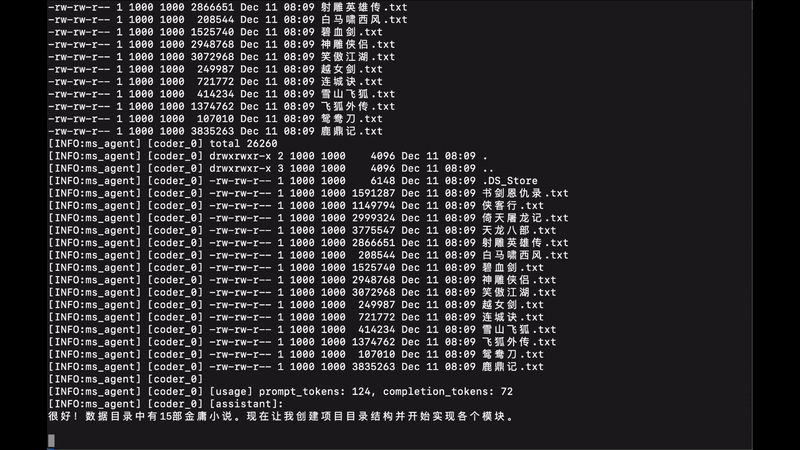
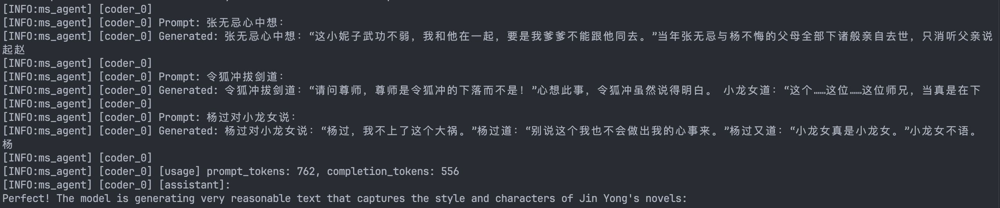

# ms-agent / AutoCoding
基于 ModelScope Agent 的多智能体自动编码工作流示例。

## 主要特性
- **配置驱动**：通过 `workflow.yaml` 与 `agent.yaml`/`agent.yml` 描述多智能体的有向流程与各自能力，无需改代码即可调整。
- **多模型兼容**：支持 OpenAI 兼容接口与 ModelScope Inference，按需切换 `llm.service`、`model`、`openai_base_url`、`modelscope_api_key`。
- **丰富工具链**：文件系统、Web 搜索/研究、RAG、Kaggle、Shell 执行、分任务拆解、状态切换等工具可按需启用。
- **可插拔记忆**：内置状态记忆与缓存，支持 `--load_cache` 复用历史对话/工具调用。
- **CLI 一键运行**：`python -m ms_agent.cli.cli run --config ...` 即可启动单 agent 或多 agent 工作流，可提供首次 query 或进入交互模式。

## 目录速览
```
ms_agent/             # 核心库（agent、workflow、tools、memory 等）
projects/deepcodingresearch/
	workflow.yaml       # 示例多智能体流程图
	research.yaml       # 研究 agent 配置
	coding.yaml         # 编码 agent 配置
	refine.yaml         # 测试/调试 agent 配置
requirements.txt      # 依赖列表
unit_test/            # 单元测试样例
```

## 环境准备
- Python 3.11（建议使用 conda/venv）
- 已获取的 OpenAI 兼容 API Key 或 ModelScope API Key

```bash
conda create -n autocoding python=3.11
conda install poppler
conda activate autocoding
pip install -r requirements.txt
```

## docker 环境
用该命令构建 docker 镜像：
```bash
sh set_up.sh
```
支持 cuda 环境，包含基本的开发依赖。

设置相关api-key
```bash
export SERPER_KEY_ID = xxx
export OPENAI_API_KEY = xxx
export JINA_API_KEYS = xxx
```
google api 可以通过https://serper.dev/verify-email获取免费额度
jina api 可以通过https://jina.ai/获取免费额度


## 快速运行
以示例工作流 `projects/deepcodingresearch/workflow.yaml` 为例：

```bash
PYTHONPATH=. python ms_agent/cli/cli.py run --config projects/deepcodingresearch --query '查看目录下的instructions.txt文件并执行相关任务' --trust_remote_code true
```

- 若省略 `--query`，将进入交互模式。
- `--load_cache true`：复用上一次的对话/工具调用缓存。
- `--trust_remote_code true`：信任远端模型仓库中的自定义代码（从 ModelScope 拉取配置时需显式开启）。
- `--mcp_config` / `--mcp_server_file`：额外挂载 MCP server 配置。

## 配置说明
### 工作流 (`workflow.yaml`)
定义节点关系与各节点使用的 agent 配置文件：
next： 可以进行转移的状态
description: 该状态的描述，用于agent选择状态

```yaml
research:
    next: [coding]
    agent_config: research.yaml
	description: description for research
coding:
    next: [structure_evaluate, research, refine]
    agent_config: coding.yaml
	description: description for coding
structure_evaluate:
    next: [coding]
    agent_config: structure_evaluate.yaml
	description: description for structure_evaluate
refine:
    next: [exit, coding]
    agent_config: refine.yaml
    description: description for refine
exit:
    description: description for exit
```

### 单 Agent (`*.yaml`)
关键字段示例（摘自 `projects/deepcodingresearch/coding.yaml`）：
```yaml
llm:
	service: openai
	model: qwen3-max
	openai_api_key: 
	openai_base_url: https://dashscope.aliyuncs.com/compatible-mode/v1
agent: coding
type: state_llmagent
generation_config:
	temperature: 0.2
	max_tokens: 32000
prompt:
	system: |
		# 系统指令...
callbacks:
	- callbacks/tool_use_callback
tools:
	state_transition: { mcp: false }
	file_system:
		mcp: false
		ignore_files: [paper.md]
memory:
	- name: statememory
		user_id: "code_scratch"
max_chat_round: 100
tool_call_timeout: 30000
output_dir: new_output
```

## 常用工具能力
- `docker_shell`：在容器内执行 shell 命令。
- `state_transition`：在工作流节点间传递状态/结果。
- `file_system`：读写/列目录等文件操作（可配置忽略/长度限制）。
- `document_inspector`：agentic tool,结构化解析文档内容。
- `deepresearch` / `web_search` / `web_research`：agentic tool,网页检索与研究。
- `split_task`：将编码任务拆解为可并行的子任务。
- `rag_tool`：基于 RAG 的检索与问答。
- `kaggle_tools`：下载/操作 Kaggle 数据集(需要先参加比赛并设置api)。
- `docker_shell`：利用docker构建安全执行环境
- `run_shell`:缺乏docker_shell环境时的备选，但是因为命令受限会影响效果

## 单元测试
### 快速执行
需要先通过unit_test中的配置文件的路径修改相应的配置文件
```bash
python -m unit_test.test_deepresearch
python -m unit_test.test_rag
...
```

测试statememory 构建了一个模拟拍卖环境来测试agent之间的交互情况
```bash
PYTHONPATH=. python ms_agent/cli/cli.py run --config unit_test/test_state_memory --query 'auction start' --trust_remote_code true --load_cache true
```


### 单测覆盖点
- `test_deepresearch.py`：调用 `DeepresearchTool` 的 research 能力示例。
- `test_document_tool.py`：使用 `document_inspector` 对 `unit_test/paper.pdf` 做问答抽取（输出写入 `./unit_test`）。
- `test_rag.py`：初始化多路 `llama-index` RAG，构建索引后进行查询并打印调试信息。
- `test_file_parser.py`：演示 `SingleFileParser` 真实文件解析与缓存命中校验（需将示例中的文件路径与缓存目录替换为本地可用路径）。
- `test_state_memory/`：自定义拍卖工作流的状态迁移配置样例 (`workflow.yaml` 等)。

> 部分测试需要外部依赖：
> - LLM/RAG/视觉解析相关测试需有效的 OpenAI 兼容或 ModelScope API Key（放入 `.env` 或直接设环境变量）。
> - `test_file_parser.py` 需要你提供真实的本地文件路径，并在有图片时准备视觉解析所需的 Key。


## Human-in-the-Loop
支持随时打断，用户输入新指令，调整任务方向或细节。

用法为在 agent 每轮的输出时，或在调用 `docker_shell` 工具时，在终端输入命令 `/i` 即可进入人机交互模式，等待用户输入新指令，输入完成后，agent 会继续执行新的指令。

效果gif示例：



## Examples

### Kaggle 竞赛

在 `run_kaggle.sh` 中配置你的 API Key 和 Kaggle API TOKEN 
```bash
rm -rf memory
rm -rf output
mkdir output
export OPENAI_API_KEY="Your_OpenAI_API_Key_Here"
export SERPER_KEY_ID="Your_Serper_API_Key_Here"
export JINA_API_KEYS="Your_Jina_API_Keys_Here"
export KAGGLE_API_TOKEN="Your_Kaggle_API_Token_Here"
python -m ms_agent.cli.cli run --config projects/kaggle --trust_remote_code true --openai_api_key ${OPENAI_API_KEY} --query "请你参加 kaggle 竞赛 Spaceship Titanic: https://www.kaggle.com/competitions/spaceship-titanic/leaderboard。尽可能获得更高的排名（尽量将预测准确率提升到 0.81 以上）。最终你需要生成一个用于提交的 csv 文件，包含你的预测结果。"
```

然后运行：
```bash
sh run_kaggle.sh
```


即可启动一个多智能体工作流，自动下载数据集、分析任务、生成代码并提交结果。

### miniGPT
在 `run_gpt.sh` 中配置你的 API Key 
```bash
rm -rf memory
rm -rf output
mkdir output
cp -r ./examples/gpt_data/data ./output/data
export OPENAI_API_KEY="Your_OpenAI_API_Key_Here"
export SERPER_KEY_ID="Your_Serper_API_Key_Here"
export JINA_API_KEYS="Your_Jina_API_Keys_Here"
python -m ms_agent.cli.cli run --config projects/gpt --trust_remote_code true --openai_api_key ${OPENAI_API_KEY} --query "你需要基于 PyTorch 从零实现一个参数量约为 30M 的 Causal Transformer 模型（即 Mini-GPT），并使用我提供的文本进行训练。最终能使得你训练的模型能输出相对合理的文本。训练数据为金庸的多部小说，路径为 /workspace/data/, 格式为多个 .txt 文件。当前设备下有 GPU 可用，请使用 cuda 加速训练过程, 先运行一个快速训练，然后尽量利用多 gpu，调到合适的 batch size，加速训练。最后你需要能训练出一个输出正常文本的模型权重，并说明如何生成文本。需要保证已经有训练好的模型权重，用户可以直接使用该模型权重进行文本生成。"
```

然后运行：
```bash
sh run_gpt.sh
```

最终可以训练出一个“以金庸小说风格写作”的 miniGPT 模型。

效果截图：



