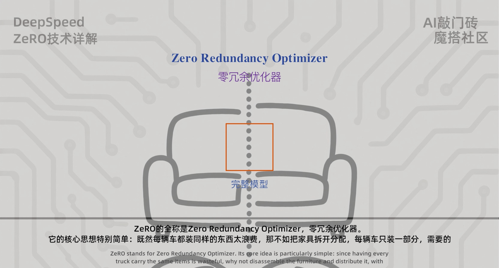
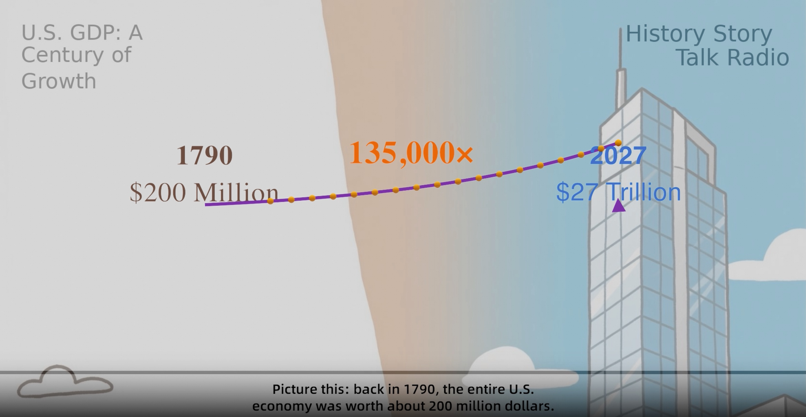

# MS-Agent: 赋能智能体自主探索的轻量级框架

<p align="center">
    <br>
    
    <br>
<p>

<p align="center">
<a href="https://modelscope.cn/mcp/playground">MCP Playground</a> | <a href="https://arxiv.org/abs/2309.00986">Paper</a> | <a href="https://ms-agent-en.readthedocs.io">Documentation</a> | <a href="https://ms-agent.readthedocs.io/zh-cn">中文文档</a>
<br>
</p>

<p align="center">

<a href='https://ms-agent.readthedocs.io/zh-cn/latest/'>
    
</a>
<a href="https://github.com/modelscope/ms-agent/actions?query=branch%3Amaster+workflow%3Acitest++"></a>
<a href="https://github.com/modelscope/ms-agent/blob/main/LICENSE"></a>
<a href="https://github.com/modelscope/ms-agent/pulls"></a>
<a href="https://pypi.org/project/ms-agent/"></a>
<a href="https://pepy.tech/project/ms-agent"></a>
</p>

<p align="center">
<a href="https://trendshift.io/repositories/323" target="_blank"></a>
</p>


[**README**](README.md)


## 简介
MS-Agent是一个轻量级框架，旨在为智能体提供自主探索能力。它提供了灵活且可扩展的架构，允许开发者创建能够执行复杂任务的智能体，如代码生成、数据分析，以及基于MCP（模型调用协议）支持的通用工具调用。

### 特性

- **通用多智能体**：基于MCP的工具调用能力与智能体聊天。
- **深度研究**：启用自主探索和复杂任务执行的高级能力。
- **代码生成**：支持复杂项目的代码生成任务。
- **短视频生成**：支持5分钟左右的短视频生成。
- **Agent Skills**：兼容Anthropic-Agent-Skills协议，实现智能体技能模块。
- **轻量级且可扩展**：易于扩展和定制以适应各种应用。

> 历史存档版本，请参考：https://github.com/modelscope/ms-agent/tree/0.8.0

|  微信群
|:-------------------------:
|  

## 🎉 新闻

* 🎬 2025.11.13: 发布了“奇点放映室”，用于进行知识类文档的复杂场景短视频制作，具体查看[这里](projects/singularity_cinema/README.md)

* 🚀 2025.11.12：发布MS-Agent v1.5.0，包含以下更新：
  - 🔥 新增 [**FinResearch**](projects/fin_research/README.md)，支持金融领域的深度研究和分析
  - 支持基于[Akshare](https://github.com/akfamily/akshare)和[Baostock](http://baostock.com/mainContent?file=home.md)的金融数据获取工具
  - 支持以Dag形式编排工作流
  - 优化DeepResearch稳定性与效率

* 🚀 2025.11.07：发布MS-Agent v1.4.0，包含以下更新：
  - 🔥 新增 [**MS-Agent Skills**](projects/agent_skills/README.md), 基于 [**Anthropic-Agent-Skills**](https://docs.claude.com/en/docs/agents-and-tools/agent-skills) 协议实现.
  - 🔥 新增 [中文文档](https://ms-agent.readthedocs.io/zh-cn)和[英文文档](https://ms-agent-en.readthedocs.io/en)
  - 🔥 支持沙箱框架 [ms-enclave](https://github.com/modelscope/ms-enclave)

* 🚀 2025.9.22：发布MS-Agent v1.3.0，包含以下更新：
  - 🔥 支持[Code Scratch](projects/code_scratch/README.md)
  - 支持`Memory`用于构建具有长期和短期记忆的智能体
  - 增强DeepResearch工作流
  - 支持RAY加速文档信息提取
  - 支持LLMs的Anthropic API格式

* 🚀 2025.8.28：发布MS-Agent v1.2.0，包含以下更新：
  - DocResearch现在支持推送到`ModelScope`、`HuggingFace`、`GitHub`以便于分享研究报告。详情请参考[Doc Research](projects/doc_research/README.md)。
  - DocResearch现在支持将Markdown报告导出为`HTML`、`PDF`、`PPTX`和`DOCX`格式，详情请参考[Doc Research](projects/doc_research/README.md)。
  - DocResearch现在支持`TXT`文件处理和文件预处理，详情请参考[Doc Research](projects/doc_research/README.md)。

* 🚀 2025.7.31：发布MS-Agent v1.1.0，包含以下更新：
- 🔥 支持[文档研究](projects/doc_research/README.md)，演示：[DocResearchStudio](https://modelscope.cn/studios/ms-agent/DocResearch) - 为智能洞察（DeepResearch）添加`通用网络搜索引擎`
  - 为Agent与MCP聊天添加`最大连续运行次数`。

* 🚀 2025.7.18：发布MS-Agent v1.0.0，改进Agent与MCP聊天的体验，并更新[智能洞察](projects/deep_research/README.md)的说明文档。

* 🚀 2025.7.16：发布MS-Agent v1.0.0rc0，包含以下更新：
  - 支持Agent与MCP（模型上下文协议）聊天
  - 支持深度研究（智能洞察），参考：[报告演示](projects/deep_research/examples/task_20250617a/report.md)，[脚本演示](projects/deep_research/run.py)
  - 支持[MCP-Playground](https://modelscope.cn/mcp/playground)
  - 为Agent聊天添加回调机制


<details><summary>归档</summary>

* 🔥🔥🔥2024年8月8日：Modelscope-Agent发布了一个新的基于图的代码生成工具[CodexGraph](https://arxiv.org/abs/2408.03910)，它已被证明在各种代码相关任务上有效且通用，请查看[示例](https://github.com/modelscope/modelscope-agent/tree/master/apps/codexgraph_agent)。
* 🔥🔥2024年8月1日：一个高效可靠的数据科学助手正在Modelscope-Agent上运行，请在[示例](https://github.com/modelscope/modelscope-agent/tree/master/apps/datascience_assistant)中查看详情。
* 🔥2024年7月17日：Modelscope-Agent-Server上的并行工具调用，请在[文档](https://github.com/modelscope/modelscope-agent/blob/master/modelscope_agent_servers/README.md)中查看详情。
* 🔥2024年6月17日：基于LLama-index升级RAG流程，允许用户通过不同策略和模态混合搜索知识，请在[文档](https://github.com/modelscope/modelscope-agent/blob/master/modelscope_agent/rag/README_zh.md)中查看详情。
* 🔥2024年6月6日：通过 [Modelscope-Agent-Server](https://github.com/modelscope/modelscope-agent/blob/master/modelscope_agent_servers/README.md)，**Qwen2** 可以通过 OpenAI SDK 使用工具调用能力，详情请查看[文档](https://github.com/modelscope/modelscope-agent/blob/master/docs/llms/qwen2_tool_calling.md)。
* 🔥2024年6月4日：Modelscope-Agent 支持 Mobile-Agent-V2[arxiv](https://arxiv.org/abs/2406.01014)，基于 Android Adb 环境，请在[应用](https://github.com/modelscope/modelscope-agent/tree/master/apps/mobile_agent)中查看。
* 🔥2024年5月17日：Modelscope-Agent 在 [gradio](https://github.com/modelscope/modelscope-agent/tree/master/apps/multi_roles_chat_room) 中支持多角色房间聊天。
* 2024年5月14日：Modelscope-Agent 在 `RolePlay` 智能体中支持图像输入，使用最新的 OpenAI 模型 `GPT-4o`。开发者可以通过指定 `image_url` 参数来体验此功能。
* 2024年5月10日：Modelscope-Agent 推出了用户友好的 `Assistant API`，并提供了在隔离、安全容器中执行实用程序的 `Tools API`，请查看[文档](https://github.com/modelscope/modelscope-agent/blob/master/modelscope_agent_servers/)
* 2024年4月12日：多智能体解决方案的 [Ray](https://docs.ray.io/en/latest/) 版本已在 modelscope-agent 上线，请查看[文档](https://github.com/modelscope/modelscope-agent/blob/master/modelscope_agent/multi_agents_utils/README.md)
* 2024年3月15日：Modelscope-Agent 和 [AgentFabric](https://github.com/modelscope/modelscope-agent/tree/master/apps/agentfabric)（GPTs 的开源版本）正在 [modelscope studio](https://modelscope.cn/studios/agent) 的生产环境中运行。
* 2024年2月10日：在中国新年期间，我们将modelscope agent升级到v0.3版本，以便开发者通过编码更方便地定制各种类型的智能体，并使多智能体演示更容易实现。更多详情，您可以参考[#267](https://github.com/modelscope/modelscope-agent/pull/267)和[#293](https://github.com/modelscope/modelscope-agent/pull/293)。

* 2023年11月26日：[AgentFabric](https://github.com/modelscope/modelscope-agent/tree/master/apps/agentfabric)现在支持在ModelScope的[创作空间](https://modelscope.cn/studios/modelscope/AgentFabric/summary)中协作使用，允许在创作空间中分享自定义应用程序。此次更新还包括最新的[GTE](https://modelscope.cn/models/damo/nlp_gte_sentence-embedding_chinese-base/summary)文本嵌入集成。

* 2023年11月17日：[AgentFabric](https://github.com/modelscope/modelscope-agent/tree/master/apps/agentfabric)发布，这是一个交互式框架，旨在促进创建针对各种现实世界应用的智能体。

* 2023年10月30日：[Facechain Agent](https://modelscope.cn/studios/CVstudio/facechain_agent_studio/summary)发布了可以在本地运行的Facechain Agent本地版本。详细使用说明请参考[Facechain Agent](#facechain-agent)。

* 2023年10月25日：[Story Agent](https://modelscope.cn/studios/damo/story_agent/summary)发布了用于生成故事书插图的Story Agent本地版本。它可以在本地运行。详细使用说明请参考[Story Agent](#story-agent)。

* 2023年9月20日：[ModelScope GPT](https://modelscope.cn/studios/damo/ModelScopeGPT/summary)通过gradio提供了可以在本地运行的本地版本。您可以导航到demo/msgpt/目录并执行`bash run_msgpt.sh`。
* 2023年9月4日：新增了三个演示，[demo_qwen](demo/demo_qwen_agent.ipynb)、[demo_retrieval_agent](demo/demo_retrieval_agent.ipynb) 和 [demo_register_tool](demo/demo_register_new_tool.ipynb)，并提供了详细的教程。
* 2023年9月2日：发布了与该项目相关的[预印本论文](https://arxiv.org/abs/2309.00986)。
* 2023年8月22日：支持使用 ModelScope 令牌访问各种 AI 模型 API。
* 2023年8月7日：发布了 modelscope-agent 仓库的初始版本。

</details>


## 安装

### 从 PyPI 安装

```shell
# 基础功能
pip install ms-agent

# 深度研究功能
pip install 'ms-agent[research]'
```


### 从源码安装

```shell
git clone https://github.com/modelscope/ms-agent.git

cd ms-agent
pip install -e .
```


> [!WARNING]
> 由于项目已重命名为 `ms-agent`，对于 `v0.8.0` 或更早版本，您可以使用以下命令安装：
> ```shell
> pip install modelscope-agent<=0.8.0
> ```
> 使用 `modelscope_agent` 导入相关依赖：
> ``` python
> from modelscope_agent import ...
> ```


## 快速开始

### Agent 对话
该项目支持通过 MCP（模型上下文协议）与模型进行交互。以下是一个完整的示例，展示了如何配置和运行支持 MCP 的 LLMAgent。

✅ 使用 MCP 协议与 agent 对话：[MCP Playground](https://modelscope.cn/mcp/playground)

默认情况下，agent 使用 ModelScope 的 API 推理服务。在运行 agent 之前，请确保设置您的 ModelScope API 密钥。
```bash
export MODELSCOPE_API_KEY={your_modelscope_api_key}
```
您可以在 https://modelscope.cn/my/myaccesstoken 找到或生成您的 API 密钥。

```python
import asyncio

from ms_agent import LLMAgent

# Configure MCP servers
mcp = {
  "mcpServers": {
    "fetch": {
      "type": "streamable_http",
      "url": "https://mcp.api-inference.modelscope.net/{your_mcp_uuid}/mcp"
    }
  }
}

async def main():
    # Use json to configure MCP
    llm_agent = LLMAgent(mcp_config=mcp)   # Run task
    await llm_agent.run('Introduce modelscope.cn')

if __name__ == '__main__':
    # Start
    asyncio.run(main())
```
----
💡 提示：您可以在 modelscope.cn/mcp 找到可用的 MCP 服务器配置。

例如：https://modelscope.cn/mcp/servers/@modelcontextprotocol/fetch。
将 `mcp["mcpServers"]["fetch"]` 中的 url 替换为您自己的 MCP 服务器端点。

<details><summary>记忆</summary>

我们在 v1.3.0 版本中通过使用 [mem0](https://github.com/mem0ai/mem0) 支持记忆功能！🎉

下面是一个简单的入门示例。更全面的测试用例，请参考 [test_case](tests/memory/test_default_memory.py)。

在运行智能体之前，请确保您已经为 LLM 设置了 ModelScope API 密钥。

⚠️ 注意：截至目前，ModelScope API-Inference 尚未提供嵌入接口（即将推出）。因此，我们依赖外部 API 提供商进行嵌入。默认情况下，此实现使用 DashScope。在运行示例之前，请确保设置您的 DASHSCOPE_API_KEY。

```bash
pip install mem0ai
export MODELSCOPE_API_KEY={your_modelscope_api_key}
export DASHSCOPE_API_KEY={your_dashscope_api_key}
```

您可以在以下位置获取或生成您的 API 密钥：

* [modelscope_api_key](https://modelscope.cn/my/myaccesstoken)
* [dashscope_api_key](https://bailian.console.aliyun.com/?spm=5176.29619931.J__Z58Z6CX7MY__Ll8p1ZOR.1.4bf0521cWpNGPY&tab=api#/api/?type=model&url=2712195)。

**使用示例**

此示例演示了智能体如何使用持久记忆在会话间记住用户偏好：

```python
import uuid
import asyncio
from omegaconf import OmegaConf
from ms_agent.agent.loader import AgentLoader


async def main():
    random_id = str(uuid.uuid4())
    default_memory = OmegaConf.create({
        'memory': [{
            'path': f'output/{random_id}',
            'user_id': 'awesome_me'
        }]
    })
    agent1 = AgentLoader.build(config_dir_or_id='ms-agent/simple_agent', config=default_memory)
    agent1.config.callbacks.remove('input_callback')  # Disable interactive input for direct output

    await agent1.run('I am a vegetarian and I drink coffee every morning.')
    del agent1
    print('========== Data preparation completed, starting test ===========')
    agent2 = AgentLoader.build(config_dir_or_id='ms-agent/simple_agent', config=default_memory)
    agent2.config.callbacks.remove('input_callback')  # Disable interactive input for direct output

    res = await agent2.run('Please help me plan tomorrow’s three meals.')
    print(res)
    assert 'vegan' in res[-1].content.lower() and 'coffee' in res[-1].content.lower()

asyncio.run(main())
```

</details>


### Agent Skills

**MS-Agent Skills** 模块是对 [**Anthropic-Agent-Skills**](https://docs.claude.com/en/docs/agents-and-tools/agent-skills) 协议的实现，允许开发者轻松创建、管理和使用智能体技能，提升智能体在复杂任务上的表现。


#### 1) 核心特性

- 📜 **标准技能协议**：完全兼容 [Anthropic Skills](https://github.com/anthropics/skills) 协议
- 🧠 **启发式上下文加载**：仅在需要时加载必要的上下文，如`References`、`Resources`和`Scripts`等
- 🤖 **自主执行**：智能体根据技能定义，自主分析、规划和决策执行哪些脚本和资源
- 🔍 **技能管理**：支持技能批量加载，可根据用户输入自动检索和发现相关技能
- 🛡️ **代码执行环境**：可选代码本地直接执行，或使用沙箱环境（[**ms-enclave**](https://github.com/modelscope/ms-enclave)），自动处理依赖项安装和环境隔离
- 📁 **多文件类型支持**：支持文档、脚本和资源文件
- 🧩 **可扩展设计**：对「技能」的数据结构进行了模块化设计，提供 `SkillSchema`、`SkillContext`等实现，便于扩展和定制

#### 2) 快速开始

> 💡 提示：
> 1. 在运行以下示例之前，请确保设置了 `OPENAI_API_KEY` 和 `OPENAI_BASE_URL` 环境变量，以便访问所需的模型 API
> 2. Agent Skills 要求 ms-agent 版本 >= 1.4.0


**安装依赖**：

```shell
pip install ms-agent
```

**使用示例**：
> 该示例展示了如何配置和运行一个Agent Skill，基于p5.js的流场生成艺术代码。


参考代码： [Run Skills](projects/agent_skills/run.py)


**运行结果**：

<div align="center">
  
  <p><em>Agent-Skills: Flow Field Particles</em></p>
</div>


#### 3) 参考文档
- **README**：请参考 [MS-Agent Skills](projects/agent_skills/README.md)
- **Anthropic Agent Skills官方文档**：请参考 [Anthropic-Agent-Skills](https://docs.claude.com/en/docs/agents-and-tools/agent-skills)
- **Anthropic预定义Skills GitHub仓库**：请参考 [Skills](https://github.com/anthropics/skills)


### Agentic Insight

#### - 轻量级、高效且可扩展的多模态深度研究框架

该项目提供了一个**深度研究**框架，使智能体能够自主探索和执行复杂任务。

#### 🌟 特性

- **自主探索** - 针对各种复杂任务的自主探索

- **多模态** - 能够处理多样化的数据模态，生成包含丰富文本和图像的研究报告。

- **轻量级与高效** - 支持"搜索后执行"模式，在几分钟内完成复杂的研究任务，显著减少token消耗。

#### 📺 演示

以下是Agentic Insight框架的实际演示，展示了其在高效处理复杂研究任务方面的能力。

- **用户查询**

- - 中文：

```text
在计算化学这个领域，我们通常使用Gaussian软件模拟各种情况下分子的结构和性质计算，比如在关键词中加入'field=x+100'代表了在x方向增加了电场。但是，当体系是经典的单原子催化剂时，它属于分子催化剂，在反应环境中分子的朝向是不确定的，那么理论模拟的x方向电场和实际电场是不一致的。

请问：通常情况下，理论计算是如何模拟外加电场存在的情况？
```

- - 英文：
```text
在计算化学领域，我们经常使用Gaussian软件来模拟分子在各种条件下的结构和性质。例如，在关键词中添加'field=x+100'表示沿x方向施加电场。然而，当处理经典的单原子催化剂时，它属于分子催化范畴，分子在反应环境中的取向是不确定的。这意味着理论模拟中的x方向电场可能与实际电场不一致。

那么，在理论计算中通常如何模拟外部电场呢？

```

#### 报告

<https://github.com/user-attachments/assets/b1091dfc-9429-46ad-b7f8-7cbd1cf3209b>


更多详情，请参考[深度研究](projects/deep_research/README.md)。

<br>

### 文档研究

该项目提供了**文档研究**框架，使智能体能够自主探索和执行与文档分析和研究相关的复杂任务。

#### 特性

  - 🔍 **深度文档研究** - 支持文档的深度分析和总结
  - 📝 **多种输入类型** - 支持多文件上传和URL输入
  - 📊 **多模态报告** - 支持Markdown格式的文本和图像报告
  - 🚀 **高效率** - 利用强大的LLM进行快速准确的研究，利用关键信息提取技术进一步优化token使用
  - ⚙️ **灵活部署** - 支持本地运行和[ModelScope Studio](https://modelscope.cn/studios)
  - 💰 **免费模型推理** - 为ModelScope用户提供免费的LLM API推理调用，参考[ModelScope API-推理](https://modelscope.cn/docs/model-service/API-Inference/intro)


#### 演示

**1. ModelScope Studio**
[DocResearchStudio](https://modelscope.cn/studios/ms-agent/DocResearch)

**2. 本地Gradio应用**

* 针对[UniME: Breaking the Modality Barrier: Universal Embedding Learning with Multimodal LLMs](https://arxiv.org/pdf/2504.17432)的研究报告
<div align="center">
  
  <p><em>演示：UniME 研究报告</em></p>
</div>

更多详情，请参考 [文档研究](projects/doc_research/README.md)

<br>

### Code Scratch

该项目提供了一个 **Code Scratch** 框架，使智能体能够自主生成代码项目。

#### 特性

  - 🎯 **复杂代码生成** - 支持复杂代码生成任务，特别是 React 前端和 Node.js 后端
  - 🔧 **可定制工作流** - 使用户能够自由开发针对特定场景的代码生成工作流
  - 🏗️ **三阶段架构** - 设计与编码阶段，然后是完善阶段，用于稳健的代码生成和错误修复
  - 📁 **智能文件分组** - 自动分组相关代码文件，以最小化依赖关系并减少错误
  - 🔄 **自动编译与修复** - 自动 npm 编译，具有智能错误分析和迭代修复功能

#### 演示

**AI 工作空间主页**

使用以下命令生成完整的 AI 工作空间主页：

```shell
PYTHONPATH=. openai_api_key=your-api-key openai_base_url=your-api-url python ms_agent/cli/cli.py run --config projects/code_scratch --query 'Build a comprehensive AI workspace homepage' --trust_remote_code true
```

生成的代码将输出到当前目录的 `output` 文件夹中。

**架构工作流：**
- **设计阶段**：分析需求 → 生成 PRD 和模块设计 → 创建实现任务
- **编码阶段**：在智能文件组中执行编码任务 → 生成完整的代码结构
- **完善阶段**：自动编译 → 错误分析 → 迭代错误修复 → 人工评估循环

更多详情，请参考 [Code Scratch](projects/code_scratch/README.md)。

<br>

### 金融深度研究

MS-Agent FinResearch项目是一个面向金融市场研究场景的多智能体工作流，融合了金融数据分析能力与互联网舆情/资讯深度研究能力，自动生成专业的金融研究报告。

#### 1) 核心特性

- 🤖 **多智能体架构**：通过多个专用智能体的编排实现工作流，从而完成任务拆解、数据收集、量化分析、舆情研究与最终报告生成。

- 📁 **多维度分析**：涵盖金融数据指标与公众舆情两个维度，实现结构化与非结构化数据的融合分析。

- 💰 **金融数据采集**：支持模型自动获取A股、港股、美股等市场的行情、财报、宏观指标与市场数据。

- 🔍 **舆情深度研究**：新闻/媒体/社区等多源舆情深度分析。

- 📝 **专业报告生成**：按业界常用方法论（MECE、SWOT、金字塔原理等）生成多章节、结构化、图文并茂的专业报告。

- 🔒 **安全代码执行**：在隔离的 Docker 沙箱中执行数据处理与分析，保证环境安全与可复现性。

#### 2) 快速开始

> 💡 提示：
> 1. 在运行以下示例之前，请确保设置了 `OPENAI_API_KEY` 和 `OPENAI_BASE_URL` 环境变量，以便访问所需的模型 API；如果希望运行完整工作流，请配置相应的搜索引擎环境变量EXA_API_KEY（https://exa.ai）或SERPAPI_API_KEY（https://serpapi.com）。
> 2. FinResearch 要求 ms-agent 版本 >= 1.5.0。

**使用示例**：

快速启动完整FinResearch工作流进行测试：

```bash
# 在 ms-agent 根目录执行
PYTHONPATH=. python ms_agent/cli/cli.py run --config projects/fin_research --query '请分析宁德时代（300750.SZ）近四个季度盈利能力变化，并与新能源领域主要竞争对手（如比亚迪、国轩高科、中创新航）进行对比；结合产业政策与锂价波动，预测其未来两季度业绩趋势。' --trust_remote_code true
```

不配置搜索引擎也可最小化运行，将[工作流配置](projects/fin_research/workflow.yaml)调整为：

```yaml
type: DagWorkflow

orchestrator:
  next:
    - collector
  agent_config: orchestrator.yaml

collector:
  next:
    - analyst
  agent_config: collector.yaml

analyst:
  next:
    - aggregator
  agent_config: analyst.yaml

aggregator:
  agent_config: aggregator.yaml
```

**运行结果**：

<https://github.com/user-attachments/assets/a11db8d2-b559-4118-a2c0-2622d46840ef>

#### 3) 参考文档

- README：请参考[FinResearch](projects/fin_research/README_zh.md)
- 说明文档: 请参考[MS-Agent文档](https://ms-agent.readthedocs.io/zh-cn/latest/Projects/%E9%87%91%E8%9E%8D%E6%B7%B1%E5%BA%A6%E7%A0%94%E7%A9%B6.html)

### 奇点放映室

奇点放映室是一个Agent生成短视频的工作流，可以在使用一句话prompt或者知识类DOC的情况下支持高质量复杂短视频生成。

#### 1) 核心特性

- 🎬 **支持简单需求和复杂需求**：可以一句话描述需求，也可以提供复杂的信息文件

- 🎹 **复杂精美的表格和公式**：可以在短视频内部展示和台本相应的公式和图表解读

- 🎮 **端到端**：从需求到台本到分镜，从旁白音到图表到字幕，最后人工反馈和生成视频，端到端流程一个命令搞定

- 🏁 **可配置性**：可配置性高，声音、风格、素材都可以通过简单配置调节

- 🚧 **定制化**：工作流清晰简单，适合二次开发

#### 2) 快速开始

**使用示例**：


```bash
OPENAI_API_KEY=xxx-xxx T2I_API_KEY=ms-xxx-xxx MANIM_TEST_API_KEY=xxx-xxx ms-agent run --config "projects/singularity_cinema" --query "你的自定义主题" --load_cache true --trust_remote_code true
```

**运行结果**：

[](https://modelscope-open.oss-cn-hangzhou.aliyuncs.com/deepspeed-zero.mp4)

**An introduction to Deepspeed ZeRO**

[](https://modelscope-open.oss-cn-hangzhou.aliyuncs.com/a-history-of-us-gdp.mp4)

**A history of US GDP**

#### 3) 参考文档

- [完整文档](./docs/zh/Projects/短视频生成.md)

<br>

### 有趣的工作

1. 新闻收集智能体 [ms-agent/newspaper](https://www.modelscope.cn/models/ms-agent/newspaper/summary)


## 未来计划

我们致力于不断改进和扩展 MS-Agent 框架，提升大模型和智能体的能力边界。未来的计划包括：

- [x] 支持[Anthropic-Agent-Skills](https://docs.claude.com/en/docs/agents-and-tools/agent-skills) 协议，实现智能体技能模块，提升智能体在复杂任务上的表现。
- [ ] 金融深度研究智能体 **FinResearch** - 专注于金融领域的深度研究和分析。
  - [x] 长周期深度金融分析报告生成
  - [ ] 准实时事件驱动型简报生成
- [ ] **奇点放映室**
  - [ ] 支持更复杂的短视频场景
  - [ ] 提升稳定度
- [ ] 多模态检索增强生成 **Multimodal Agentic Search** - 支持大规模多模态文档检索和图文检索结果生成。
- [ ] 增强的 **Agent Skills** - 提供更多预定义的技能和工具，提升智能体技能边界，并支持多技能协作，完成复杂任务执行。
- [ ] 统一的WebUI **Agent-Workstation**，支持本地一键部署，集成了 MS-Agent 的所有智能体能力，如 AgentChat、MCP、AgentSkills、DeepResearch、DocResearch、CodeScratch 等。


## 许可证
该项目基于 [Apache License (Version 2.0)](https://github.com/modelscope/modelscope/blob/master/LICENSE) 许可证。

## Star 历史

[](https://star-history.com/#modelscope/modelscope-agent&Date)
