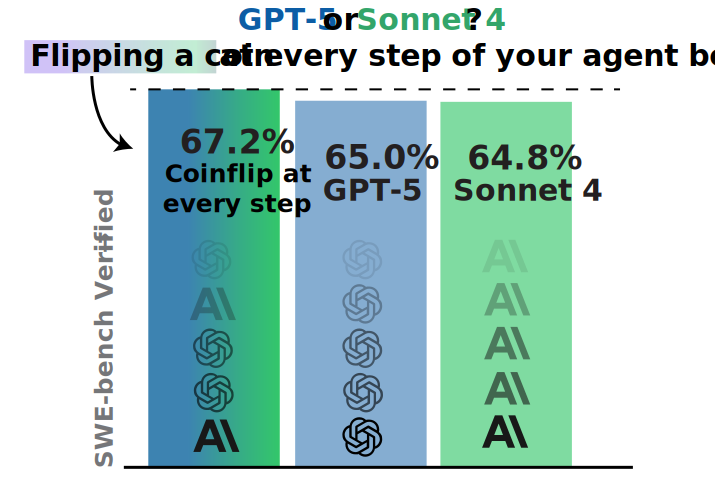
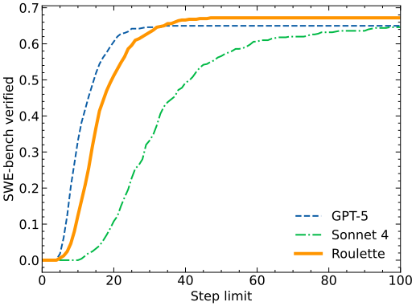
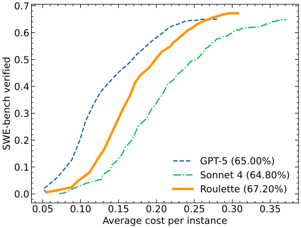

# mini-SWE-agent roulette mode: Randomly switching between models at every step can boost performance

What if your agent uses a different LM at every turn? We let mini-SWE-agent randomly switch between GPT-5 and Sonnet 4 and it scored higher on SWE-bench than with either model separately.

<!-- more -->

We use the same setup as in our [previous blog post](250808-gpt5.md), i.e., running with [`mini-swe-agent`](https://mini-swe-agent.com), a minimalistic agent that doesn't have any tools other than bash (this is the basis of our new [SWE-bench bash-only leaderboard](https://swebench.com)).

??? note "What is the `mini` agent?"

    [`mini`](https://mini-swe-agent.com) was designed to be the most minimalistic software engineering agent possible.
    In fact, its [main agent class](https://github.com/SWE-agent/mini-swe-agent/blob/main/src/minisweagent/agents/default.py)
    has less than 100 lines of code (and that's literally the agent we use for our SWE-bench leaderboard!).

    Compared to [swe-agent](https://swe-agent.com), `mini`

    - **Does not have any tools other than bash** — it doesn't even use the tool-calling interface of the LMs. This means that you can run it with literally any model. When running in sandboxed environments you also don't need to take care of installing a single package — all it needs is bash.
    - **Has a completely linear history** — every step of the agent just appends to the messages and that's it. So there's no difference between the trajectory and the messages that you pass on to the LM. Great for debugging & fine-tuning.
    - **Executes actions with `subprocess.run`** — every action is completely independent (as opposed to keeping a stateful shell session running). This makes it trivial to execute the actions in sandboxes (literally just switch out `subprocess.run` with `docker exec`) and to scale up effortlessly.

Now all we change is that instead of `model.query(history)`, we do `random.choice([model1, model2]).query(history)`,
that's it! 

Other than configuring the models, the [prompts also stay the same](https://github.com/SWE-agent/mini-swe-agent/blob/main/src/minisweagent/config/extra/swebench_roulette.yaml).


<figure markdown="span">
  
  <figcaption>We actually get higher SWE-bench scores than each of the models by themselves</figcaption>
</figure>

## Cost analysis

!!! note "TL;DR"
    The cost ends up in the middle of the two models with around 30ct per instance at maximum performance.

Comparing costs with agents is always a bit tricky, because the agents spend most of their money on instances they cannot solve, and hence the average cost heavily depends on the runtime limits (e.g., the step limit).

Similar to our [previous blog post](250808-gpt5.md), we can chart the performance vs the step limit:

<figure markdown="span">
  { style="max-width: 600px" }
  <figcaption>Performance vs step limit</figcaption>
</figure>

Showing that the performance gains become marginal at around a 50 step limit (despite the Sonnet 4 model invididually showing a very slow climb up to its maximum).
This curve is a lot more similar to the GPT-5 curve, which might be explained by the fact that either of the models can decide to end the run by submitting, so that we end up being closer to the earlier-submitting model.

Comparing the average cost with different step limits, we get a sigmoid-like curve, reaching around 30ct per instance at maximum performance, pretty much in the middle of the two models.

<figure markdown="span">
  { style="max-width: 600px" }
  <figcaption>Performance vs average cost</figcaption>
</figure>

## More models and experiments

We ran more experiments with more models at a smaller scale of just 50 instances (randomly picked from SWE-bench verified).
The GPT-5 and Sonnet 4 results were the most striking ones, and the only case where we got a higher score than with either model separately.
However, this was somewhat to be expected, as these are the only two models that are in a head-to-head race.

Whenever we combined models that were further apart in performance, the combined score (and cost) was somewhere in the middle between the two models (e.g., GPT-5 with Gemini 2.5 Pro, or GPT-5 mini with GPT-5 nano).
However, none of these combinations seemed to be particularly practically relevant.

Here's the numbers:

| Models | Score (50 instances)  |
|--------|-------|
| GPT-5 + Sonnet 4 | 39 |
| GPT-5 + Sonnet 4 + Gemini 2.5 Pro | 33 |
| GPT-5 + Gemini 2.5 Pro | 31 |
| GPT-5 + GPT-5-mini | 31 |
| GPT-5 mini + GPT-5 nano | 20 |

compared to the baselines of

| Models | Score (50 instances)  |
|--------|-------|
| Sonnet 4 | 33 |
| GPT-5 | 32 |
| GPT-5-mini | 32 |
| Gemini 2.5 Pro | 29 |
| GPT-5-nano | 16 |


A word about statistical power: 

* At just 50 instances, this small subsample is definitely not fully representative of the full 500.
  The instances we randomly drew seem to be a slightly easier subset of the data (just by chance),
  so all of the scores are slightly higher than the score on the full 500.
* For the GPT-5 + Sonnet 4 combination, we repeated a similar experiment by alternating between the two models (rather than randomly switching) and solved 333 instances (66.6%, again outperforming both models separately).
* For combinations with Gemini 2.5 Pro, we repeated them with slightly more instances, but did not see particular improvements.

## Running it yourself

To make this a bit nicer to use, we made a small wrapper model class [here](https://github.com/SWE-agent/mini-swe-agent/blob/main/src/minisweagent/models/extra/roulette.py)).

Currently, you can use it with SWE-bench evaluation simply by switching to the [`swebench_roulette` config](https://github.com/SWE-agent/mini-swe-agent/blob/main/src/minisweagent/config/extra/swebench_roulette.yaml):

```bash
mini-extra swebench \
  --subset verified \
  --split test \
  --shuffle \
  -o roulette-sonnet4-gpt5 \
  --workers 20 \
  -c swebench_roulette
```