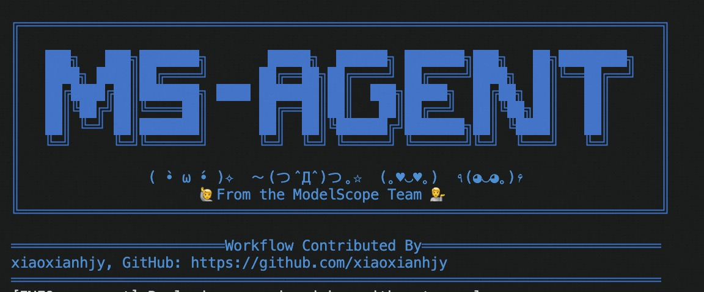

# Contributor Guide

## Workflow Contribution

MS-Agent is designed as an end-to-end workflow Agent framework based on single-command or single-search-box mode. It supports direct loading of external code and configurations:

```shell
ms-agent --config local-dir --trust_remote_code true
# or
ms-agent --config group/model-id --trust_remote_code true
```

The two methods above can load configurations and code from local directories or ModelScope model repositories respectively and run them. Based on this, secondary development for MS-Agent is not limited to direct PRs to the GitHub repository. Developers can use our basic capabilities and host their code in ModelScope model repositories. Users only need to specify the repository ID to use your code workflow.

This approach is very similar to the current projects under projects/*, with the difference being loading from local folders or model repository code. We provide several scaffold projects in the code repository that developers can build upon:

- An example of inheriting LLMAgent to implement custom logic: https://www.modelscope.cn/models/ms-agent/simple_agent_code
- A custom external workflow case: https://www.modelscope.cn/models/ms-agent/simple_workflow
- A custom external tool case: https://www.modelscope.cn/models/ms-agent/simple_tool_plugin
- An agent example with configuration files defined: https://www.modelscope.cn/models/ms-agent/simple_agent
- A slightly more complex data collection case: https://www.modelscope.cn/models/ms-agent/newspaper

We will subsequently provide an external integration method based on GitHub clone, so developers will also be able to host their code on GitHub in the future.

## Developer Recognition

You are welcome to add your work to the "Interesting works" section of the README via PR, along with an introduction to your project. Additionally, you can provide an author.txt file at the same level as your configuration file directory and write your name in it. When developers use your workflow, they will see a message like this:


