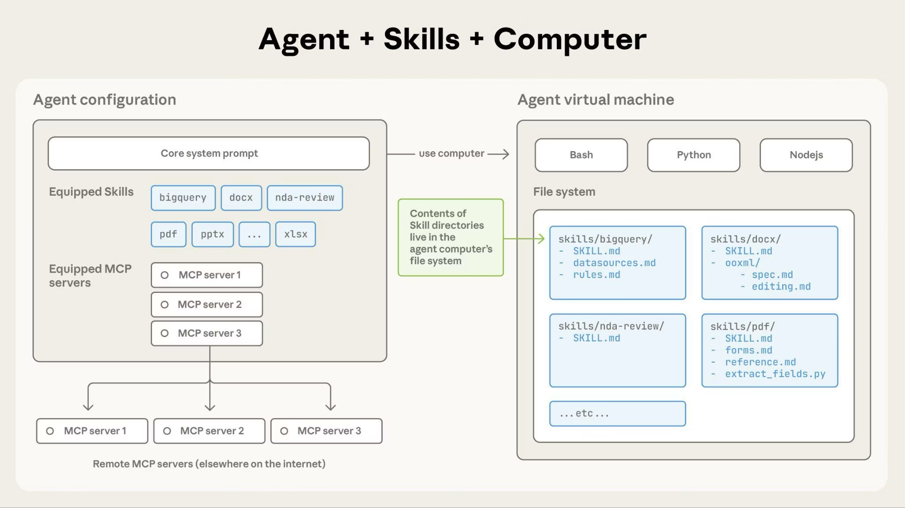
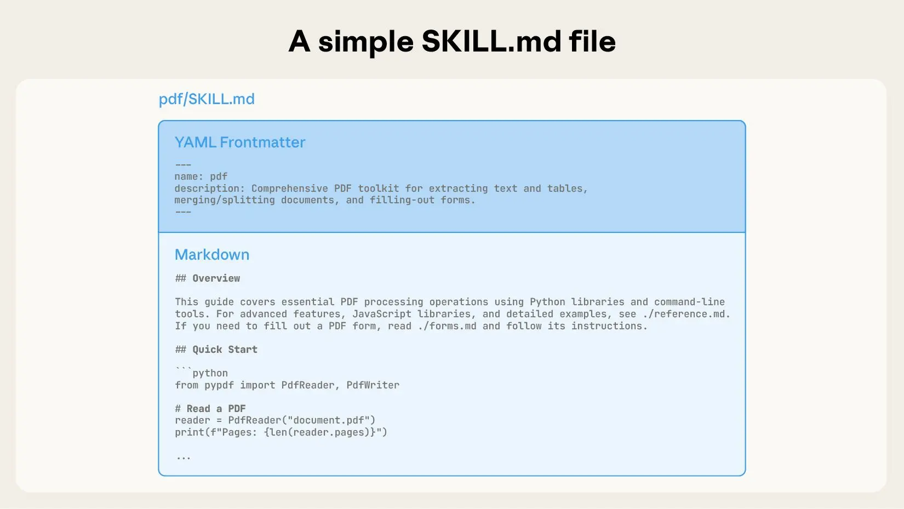
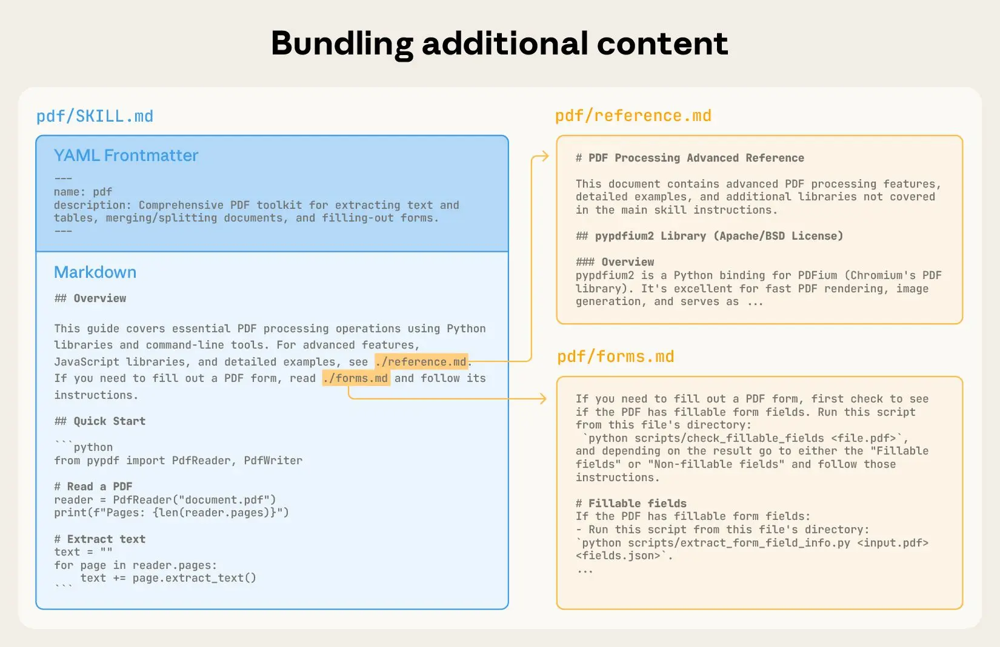
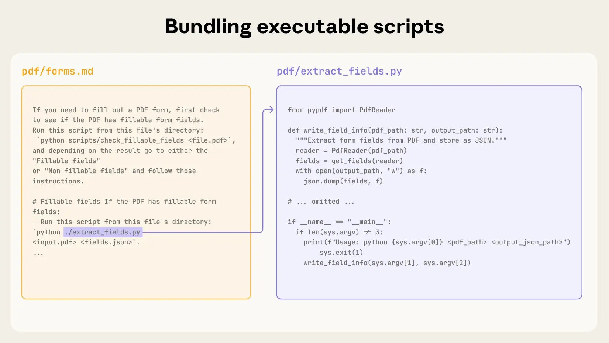
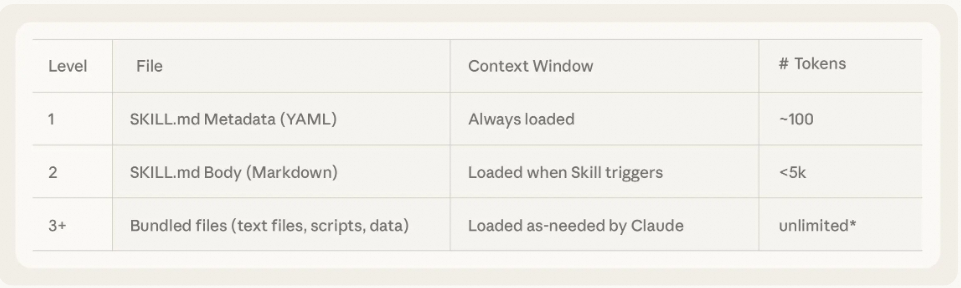
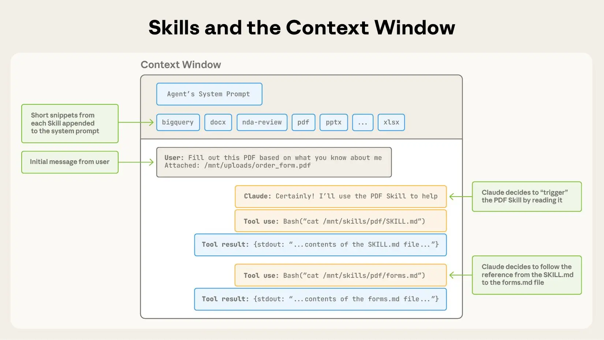

# Agent Skills (智能体技能)


## 1. 背景和动机

- **通用智能体的演进需求**
  - 随着模型能力提升，智能体已能与完整计算环境（如代码执行、文件系统）交互，执行跨领域复杂任务
  - 更强大的智能体需要模块化、可扩展、可移植的方式注入领域专业知识


- **技能即知识封装**
  - 将人类的流程性知识打包为可复用、可组合的“技能”，无需为每个场景重建定制智能体
  - 以结构化文件夹形式（含指令、脚本、资源）动态加载，使智能体在特定任务上表现更优


- **灵活性与适应性**
  - 构建技能如同编写入职指南，降低专业化门槛，提升智能体的灵活性与适应性


<br>

更多关于`Agent Skills`的内容，参考: [Anthropic Agent Skills](https://docs.claude.com/en/docs/agents-and-tools/agent-skills/overview)

<br>


## 2. 智能体技能是什么？


### 1) 架构

- 智能体技能架构




- 文件夹结构
```
skill-name/
├── SKILL.md              # Main skill definition           (Required)
├── reference.md          # Detailed reference material     (Optional)
├── LICENSE.txt           # License information             (Optional)
├── resources/            # Additional resources            (Optional)
│   ├── template.xlsx     # Example files
│   └── data.json         # Data files
└── scripts/              # Executable scripts              (Optional)
    ├── main.py           # Main implementation
    └── helper.py         # Helper functions
```

### 2) SKILL.md 文件格式

`SKILL.md` 文件使用YAML前置内容定义元数据，后续为详细说明的Markdown内容。



💡 说明：
 - `name`和`description`字段为必填项。
 - `SKILL.md`文件的正文部分应提供关于技能的全面描述，包括功能、使用说明、参考资料、资源和示例。

[SKILL.md示例](https://github.com/anthropics/skills/blob/main/document-skills/pdf/SKILL.md)


### 3) 绑定附加内容


附加的文件可以包含在`SKILL.md`中以扩展技能功能，例如：
- References (例如 `reference.md` 和 `forms.md`)



- Scripts




### 4) 技能和上下文

- 推荐设置技能文件的token限制，以确保在上下文窗口限制内高效加载






<br>


## 3. 技能的实现

### 1) 概览

**MS-Agent**框架的**AgentSkills**模块是对[Anthropic-Agent-Skills](https://docs.claude.com/en/docs/agents-and-tools/agent-skills)协议的实现（Beta版本）。

`Agent Skills`实现了多层次渐进式上下文加载机制，有效管理技能的发现与执行：

1. **Level 1 (Metadata)**: 仅加载技能元数据（名称、描述）以进行语义搜索
2. **Level 2 (Retrieval)**: 检索相关技能并加载SKILL.md全文
3. **Level 3 (Resources)**: 进一步加载技能所需的参考资料和资源文件
4. **Level 4 (Analysis|Planning|Execution)**: 分析技能上下文，自主制定计划和任务列表，并加载所需资源和运行相关脚本

这种方法在提供全面技能能力的同时，最大限度地减少资源消耗。


* 核心组件

| 组件             | 描述               |
|------------------|------------------|
| `AgentSkill`     | 主流程              |
| `SkillLoader`    | 加载和管理技能          |
| `Retriever`      | 使用语义搜索查找相关技能     |
| `SkillContext`   | 技能上下文管理          |
| `ScriptExecutor` | 技能执行模块           |
| `SkillSchema`    | 技能Schema定义       |

### 2) 主要特性

- 📜 **标准技能协议**：完全兼容 [Anthropic Skills](https://github.com/anthropics/skills) 协议
- 🧠 **启发式上下文加载**：仅按需加载必要上下文（如 `References`、`Resources` 和 `Scripts`）
- 🤖 **自主执行能力**：智能体可根据技能定义，自主分析、规划并决策需调用的脚本与资源
- 🔍 **技能管理支持**：支持批量加载技能，并能根据用户输入自动检索与发现相关技能
- 🛡️ **代码执行环境**：可选本地直接执行代码，或通过 [**ms-enclave**](https://github.com/modelscope/ms-enclave) 提供的安全沙箱执行（自动安装依赖、实现环境隔离）
- 📁 **多文件类型支持**：支持文档、脚本与资源文件等多种类型
- 🧩 **可扩展设计**：技能数据结构模块化，提供如 `SkillSchema` 和 `SkillContext` 等实现，便于扩展与定制


### 3) 安装

* Install from PyPI
```bash
pip install 'ms-agent>=1.4.0'
```

* Install from Source
```bash
git clone git@github.com:modelscope/ms-agent.git
cd ms-agent
pip install -e .
```

* Configuration
```bash
export OPENAI_API_KEY="your-api-key"
export OPENAI_BASE_URL="your-base-url"
```


### 4) 使用方法

> 下面是一个实现`流场粒子艺术生成`的示例

```python
import os
from ms_agent.agent import create_agent_skill


def main():
    """
    Main function to create and run an agent with skills.
    """
    work_dir: str = './temp_workspace'
    # Refer to `https://github.com/modelscope/ms-agent/tree/main/projects/agent_skills/skills`
    skills_dir: str = './skills'
    use_sandbox: bool = True

    ## Configuration for ModelScope API-Inference, or set your own model with OpenAI API compatible format
    ## Free LLM API inference calls for ModelScope users, refer to [ModelScope API-Inference](https://modelscope.cn/docs/model-service/API-Inference/intro)
    model: str = 'Qwen/Qwen3-235B-A22B-Instruct-2507'
    api_key: str = 'xx-xx'  # For ModelScope users, refer to `https://modelscope.cn/my/myaccesstoken` to get your access token
    base_url: str = 'https://api-inference.modelscope.cn/v1/'

    agent = create_agent_skill(
        skills=skills_dir,
        model=model,
        api_key=os.getenv('OPENAI_API_KEY', api_key),
        base_url=os.getenv('OPENAI_BASE_URL', base_url),
        stream=True,
        # Note: Make sure the `Docker Daemon` is running if use_sandbox=True
        use_sandbox=use_sandbox,
        work_dir=work_dir,
    )

    user_query: str = ('Create generative art using p5.js with seeded randomness, flow fields, and particle systems, '
                       'please fill in the details and provide the complete code based on the templates.')

    response = agent.run(query=user_query)
    print(f'\n\n** Agent skill results: {response}\n')


if __name__ == '__main__':

    main()
```

* 本地执行
  - 若 `use_sandbox=False`，技能脚本将在本地环境中直接执行
  - 请确保您信任该技能脚本，以避免潜在的安全风险
  - 请确保本地 Python 环境中已安装脚本所需的全部依赖项

* 沙箱执行
  - 若 `use_sandbox=True`，技能脚本将通过 [**ms-enclave**](https://github.com/modelscope/ms-enclave) 在隔离的 Docker 容器中执行
  - 该方式提供安全的执行环境，可有效防止对宿主系统造成潜在危害
  - 请确保您的机器上已安装 Docker，并且 Docker 服务（Docker Daemon）正在运行
  - 沙箱环境将根据技能声明的依赖项自动安装所需依赖，无需手动配置

<br>

**运行结果**


<br>


## 参考文档

* Anthropic Agent Skills官方文档：https://docs.claude.com/en/docs/agents-and-tools/agent-skills
* Anthropic Skills GitHub仓库： https://github.com/anthropics/skills

<br>
