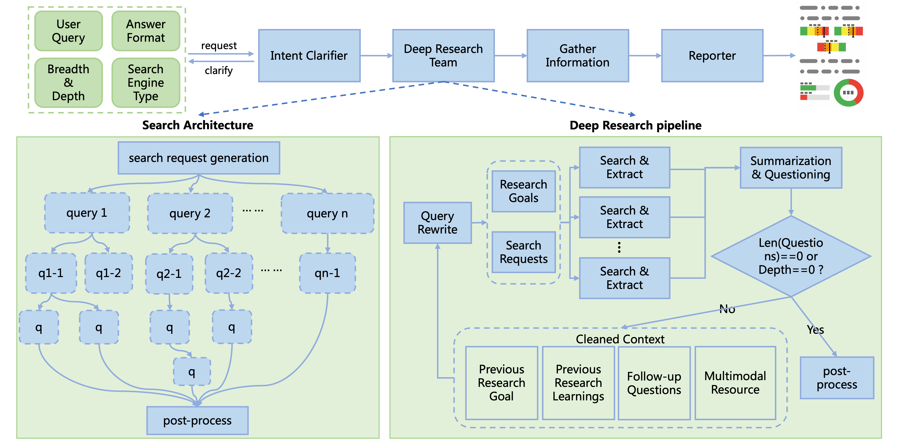

# 深度研究

MS-Agent的DeepResearch项目提供了具备复杂任务解决能力的Agent工作流，用于面向科研等领域生成深度的多模态调研报告。目前提供两个版本，分别用于支持轻量、高效的低成本调研和深度、全面的大规模调研。

## 原理介绍

### 基础版本

基础版本支持的核心特性如下：

- **自动探索**：针对不同方向的复杂问题进行自动探索与分析
- **多模态**：支持处理不同的数据模态并抽取原始图表信息，生成图文并茂的研究报告
- **轻量高效**：采用"search-then-execute"模式执行任务，仅需较低的token消耗和几分钟时间即可完成，支持使用Ray加速文档解析

获取输入query与必要的配置参数后，执行流程如下图所示：


工作流按照以下步骤执行：

- **输入处理**：接收用户query、搜索引擎配置等信息并完成初始化
- **搜索与解析**：改写用户query并搜索，基于层次化关键信息提取策略抽取包含图表等信息的核心chunk，清理、保留多模态上下文
- **报告生成**：生成保留关键图表信息的多模态研究报告，支持以多种形式导出、上传到多个平台

### 扩展版本

在保留基础版本具备的多模态处理与生成能力的同时，扩展版本支持的核心特性如下：

- **意图澄清**：通过可选的human-feedback澄清用户意图，支持多种回复模式（报告/简答）
- **深度搜索**：递归优化搜索路径，扩大信息召回覆盖面，提高主题深入程度；根据用户预算与主题研究进度自动决定是否继续深入
- **上下文压缩**：支持长上下文压缩，在多轮搜索、解析大量文档的情况下仍能保持输出稳定

获取输入query、搜索预算和必要的配置参数，执行流程如下图所示：



工作流按照以下步骤执行：

- **意图澄清**：接收用户问题，向用户提出主题相关的问题以明确研究方向，如果用户输入足够清晰则跳过此步骤
- **查询改写**：基于当前问题、探索历史（历史研究问题与结论）、搜索引擎类型生成搜索查询和研究目标
- **搜索与解析**：执行搜索、解析和信息提取，基于层次化关键信息提取策略抽取多模态上下文
- **上下文压缩**：基于抽取的多模态上下文生成信息密集的总结和后续待研究问题，保留图表与文本间的上下文关系
- **递归搜索**：重复上述过程，直到达到预期研究深度或无后续问题
- **报告生成**：整理搜索历史，根据用户需求生成多模态研究报告或简短回复

## 使用方式

### 安装

安装Deep Research项目需要遵循以下步骤：

```bash
# 源码安装
git clone https://github.com/modelscope/ms-agent.git
cd ms-agent
pip install -r requirements/research.txt
pip install -e .

# PyPI (>=v1.1.0)安装
pip install 'ms-agent[research]'
```

### 启动

#### 环境配置

项目当前默认使用免费的**arXiv search**（无需API密钥即可使用）。如果希望使用更通用的搜索引擎，可以切换到**Exa**或**SerpApi**。

- 复制并编辑.env文件配置环境变量

```bash
cp .env.example .env

# 编辑`.env`文件，需要包含希望使用的搜索引擎的API密钥
# 使用Exa搜索配置如下（注册地址为https://exa.ai, 注册时赠送免费额度）:
EXA_API_KEY=your_exa_api_key
# 使用SerpApi搜索配置如下（注册地址为https://serpapi.com, 每月赠送免费额度）:
SERPAPI_API_KEY=your_serpapi_api_key

# 扩展版本配置说明：
# 扩展版本（ResearchWorkflowBeta）在查询改写阶段会使用效果更稳定的模型（如 gemini-2.5-flash）。
# 需要配置兼容OpenAI接口的端点（OPENAI_BASE_URL）和API密钥（OPENAI_API_KEY），并支持使用对应的模型。
# 如需更换模型，可在ResearchWorkflowBeta.generate_search_queries中修改模型名称。
OPENAI_API_KEY=your_api_key
OPENAI_BASE_URL=https://your-openai-compatible-endpoint/v1
```

- 使用conf.yaml配置搜索引擎

```yaml
SEARCH_ENGINE:
    engine: exa
    exa_api_key: $EXA_API_KEY
```

#### 代码样例

- 基础版本快速启动代码如下：

```python
from ms_agent.llm.openai import OpenAIChat
from ms_agent.tools.search.search_base import SearchEngine
from ms_agent.tools.search_engine import get_web_search_tool
from ms_agent.workflow.deep_research.principle import MECEPrinciple
from ms_agent.workflow.deep_research.research_workflow import ResearchWorkflow


def run_workflow(user_prompt: str,
                 task_dir: str,
                 chat_client: OpenAIChat,
                 search_engine: SearchEngine,
                 reuse: bool,
                 use_ray: bool = False):
    """
    Run the deep research workflow, which follows a lightweight and efficient pipeline.

    Args:
        user_prompt: The user prompt.
        task_dir: The task directory where the research results will be saved.
        chat_client: The chat client.
        search_engine: The search engine.
        reuse: Whether to reuse the previous research results.
        use_ray: Whether to use Ray for document parsing/extraction.
    """

    research_workflow = ResearchWorkflow(
        client=chat_client,
        principle=MECEPrinciple(),
        search_engine=search_engine,
        workdir=task_dir,
        reuse=reuse,
        use_ray=use_ray,
    )

    research_workflow.run(user_prompt=user_prompt)


if __name__ == '__main__':

    query: str = 'Survey of the AI Agent within the recent 3 month, including the latest research papers, open-source projects, and industry applications.'  # noqa
    task_workdir: str = '/path/to/your_task_dir'
    reuse: bool = False

    # Get chat client OpenAI compatible api
    # Free API Inference Calls - Every registered ModelScope user receives a set number of free API inference calls daily, refer to https://modelscope.cn/docs/model-service/API-Inference/intro for details.  # noqa
    """
    * `api_key` (str), your API key, replace `xxx-xxx` with your actual key. Alternatively, you can use ModelScope API key, refer to https://modelscope.cn/my/myaccesstoken  # noqa
    * `base_url`: (str), the base URL for API requests, `https://api-inference.modelscope.cn/v1/` for ModelScope API-Inference
    * `model`: (str), the model ID for inference, `Qwen/Qwen3-235B-A22B-Instruct-2507` can be recommended for document research tasks.
    """
    chat_client = OpenAIChat(
        api_key='xxx-xxx',
        base_url='https://api-inference.modelscope.cn/v1/',
        model='Qwen/Qwen3-235B-A22B-Instruct-2507',
    )

    # Get web-search engine client
    # Please specify your config file path, the default is `conf.yaml` in the current directory.
    search_engine = get_web_search_tool(config_file='conf.yaml')

    # Enable Ray with `use_ray=True` to speed up document parsing.
    # It uses multiple CPU cores for faster processing,
    # but also increases CPU usage and may cause temporary stutter on your machine.
    run_workflow(
        user_prompt=query,
        task_dir=task_workdir,
        reuse=reuse,
        chat_client=chat_client,
        search_engine=search_engine,
        use_ray=False,
    )
```

- 扩展版本快速启动代码如下：

```python
import asyncio

from ms_agent.llm.openai import OpenAIChat
from ms_agent.tools.search.search_base import SearchEngine
from ms_agent.tools.search_engine import get_web_search_tool
from ms_agent.workflow.deep_research.research_workflow_beta import ResearchWorkflowBeta


def run_deep_workflow(user_prompt: str,
                      task_dir: str,
                      chat_client: OpenAIChat,
                      search_engine: SearchEngine,
                      breadth: int = 4,
                      depth: int = 2,
                      is_report: bool = True,
                      show_progress: bool = True,
                      use_ray: bool = False):
    """
    Run the expandable deep research workflow (beta version).
    This version is more flexible and scalable than the original deep research workflow.

    Args:
        user_prompt: The user prompt.
        task_dir: The task directory where the research results will be saved.
        chat_client: The chat client.
        search_engine: The search engine.
        breadth: The number of search queries to generate per depth level.
        In order to avoid the explosion of the search space,
        we divide the breadth by 2 for each depth level.
        depth: The maximum research depth.
        is_report: Whether to generate a report.
        show_progress: Whether to show the progress.
        use_ray: Whether to use Ray for document parsing/extraction.
    """

    research_workflow = ResearchWorkflowBeta(
        client=chat_client,
        search_engine=search_engine,
        workdir=task_dir,
        use_ray=use_ray,
        enable_multimodal=True)

    asyncio.run(
        research_workflow.run(
            user_prompt=user_prompt,
            breadth=breadth,
            depth=depth,
            is_report=is_report,
            show_progress=show_progress))


if __name__ == "__main__":

    query: str = 'Survey of the AI Agent within the recent 3 month, including the latest research papers, open-source projects, and industry applications.'  # noqa
    task_workdir: str = '/path/to/your_workdir'  # Specify your task work directory here

    # Get chat client OpenAI compatible api
    # Free API Inference Calls - Every registered ModelScope user receives a set number of free API inference calls daily, refer to https://modelscope.cn/docs/model-service/API-Inference/intro for details.  # noqa
    """
    * `api_key` (str), your API key, replace `xxx-xxx` with your actual key. Alternatively, you can use ModelScope API key, refer to https://modelscope.cn/my/myaccesstoken  # noqa
    * `base_url`: (str), the base URL for API requests, `https://api-inference.modelscope.cn/v1/` for ModelScope API-Inference
    * `model`: (str), the model ID for inference, `Qwen/Qwen3-235B-A22B-Instruct-2507` can be recommended for document research tasks.
    """
    chat_client = OpenAIChat(
        api_key='xxx-xxx',
        base_url='https://api-inference.modelscope.cn/v1/',
        model='Qwen/Qwen3-235B-A22B-Instruct-2507',
        generation_config={'extra_body': {
            'enable_thinking': False
        }})

    # Get web-search engine client
    # Please specify your config file path, the default is `conf.yaml` in the current directory.
    search_engine = get_web_search_tool(config_file='conf.yaml')

    # Enable Ray with `use_ray=True` to speed up document parsing.
    # It uses multiple CPU cores for faster processing,
    # but also increases CPU usage and may cause temporary stutter on your machine.
    # Tip: combine use_ray=True with show_progress=True for a better experience.
    run_deep_workflow(
        user_prompt=query,
        task_dir=task_workdir,
        chat_client=chat_client,
        search_engine=search_engine,
        show_progress=True,
        use_ray=False,
    )
```
