# Agent-RL 技术近期进展报告 (近1个月)

## 摘要

本报告总结了近期 Agent-RL (强化学习智能体) 领域的一些关键进展，涵盖了基于大型语言模型 (LLM) 的多智能体系统优化、特定应用场景下的强化学习应用以及量子智能体等新兴方向。研究重点包括提升多智能体协作效率、优化智能体架构设计、处理高维动作空间及稀疏奖励问题，以及探索强化学习在物流、交通、边缘计算和量子计算等领域的应用。

## 1. 基于LLM的多智能体系统 (MAS) 优化与设计

近期研究在利用强化学习优化和自动化LLM驱动的MAS方面取得了显著进展。

### 1.1 MHGPO: 基于群组优化的MAS策略学习

针对传统MARL算法在LLM-based MAS中的资源消耗和效率问题，MHGPO (Multi-Agent Heterogeneous Group Policy Optimization) 被提出。它采用基于群组的优化算法 (GOAs)，通过计算群组内的相对奖励进行优势估计，无需Critic模型。

*   **核心思想:** 利用群组相对奖励进行优势估计，支持异构群组。
*   **关键贡献:**
    *   提出MHGPO方法，通过多智能体rollout采样和奖励反向传播优化MAS。
    *   引入三种rollout采样策略：Independent Sampling (IS)、Fork-on-first (FoF)、Round-robin (RR)，平衡效率与效果。
    *   在三智能体LLM搜索系统上验证，MHGPO在性能和计算效率上优于PPO，且无需warm-up。

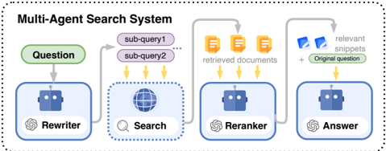 
*图1：三智能体LLM搜索系统示例：Rewriter分解问题，Reranker选择相关片段，Answerer生成最终答案。*

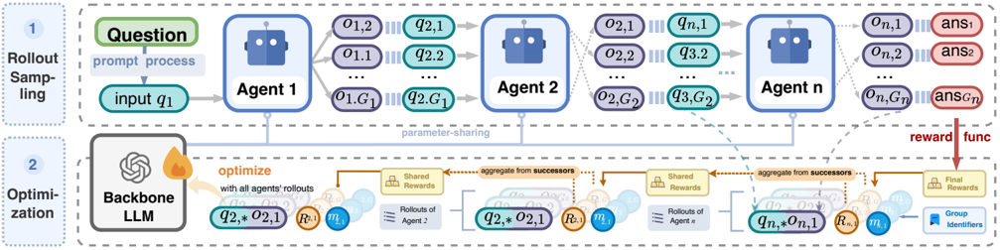 
*图2：MHGPO总体优化框架。包括多智能体rollout采样、奖励反向传播和网络参数更新。*

*   **性能与效率:**
    *   MHGPO变体比MAPPO收敛更快，RR在性能和计算开销上表现最佳。
    *   相较于MAPPO，MHGPO显著降低GPU内存使用，训练时间更短。

*表1：不同MARL算法和基线在QA数据集上的测试性能。MHGPO-FoF和MHGPO-RR在HotpotQA上优于MAPPO，且泛化性好。*

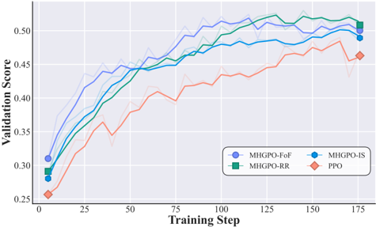 
*图5：训练过程中不同RL算法的验证分数 (F1-score)。MHGPO变体收敛更快。*

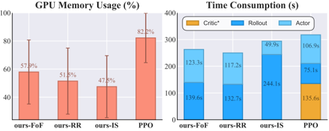 
*图6：不同MARL算法的GPU内存使用和平均每训练步时间。MHGPO内存占用和时间开销更低。*

*   **智能体行为分析:** MARL训练促使智能体学习到更有效的策略，例如Rewriter学习生成与检索引擎更匹配的子查询。

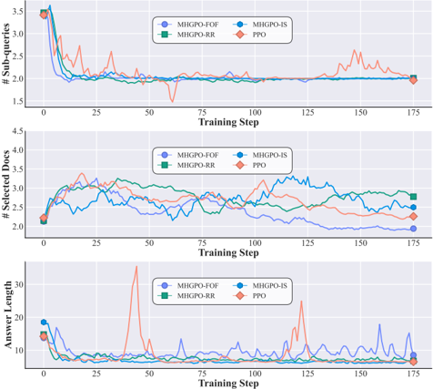 
*图8：训练过程中各智能体输出模式的变化。MHGPO变体比MAPPO更稳定。*

### 1.2 ANN: 基于文本梯度的Agentic神经网络

ANN (Agentic Neural Network) 提出将LLM-based MAS视为分层智能体团队，通过文本梯度共同优化角色、Prompt和工具。

*   **核心思想:** 将复杂任务分解为子任务，分配给分层智能体团队，通过文本反馈和梯度迭代优化局部设计和全局协调。
*   **两阶段流程:**
    *   **前向生成:** 动态分配专业智能体团队处理子任务。
    *   **后向优化:** 反向传播文本反馈，隔离错误并提出调整建议。
*   **关键组件:** 动态聚合函数选择、基于动量的文本梯度优化、基于验证的性能检查。
*   **评估:** 在数学推理、数据分析、创意写作、代码生成等任务上优于现有基线，简化MAS设计。

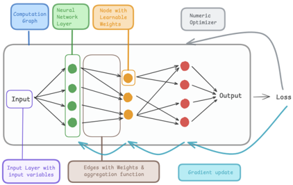 
*图1：经典神经网络与ANN的概念对比。ANN将层视为智能体团队，通过文本梯度优化。*

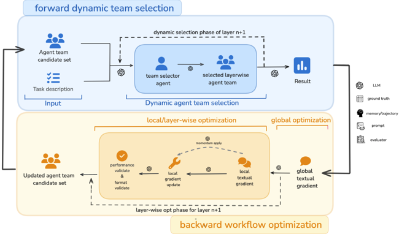 
*图2：静态智能体团队与ANN框架的区别。ANN动态选择和优化智能体团队。*

*   **消融实验:** 验证了动量优化、验证性能检查和后向优化对性能提升的重要性。

*表4：使用不同训练骨干模型在四个基准上的评估结果。ANN在不同模型规模下表现稳健。*

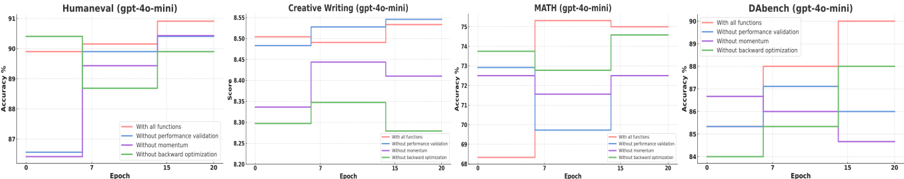 
*图3：ANN及其消融变体在四个数据集上的验证准确率曲线。完整ANN表现最佳。*

### 1.3 MasHost: 自主构建查询特定MAS

MasHost 提出一个基于RL的框架，实现查询特定MAS的完全自主构建。

*   **核心思想:** 将MAS构建建模为从零开始的图构建过程，通过RL指导。
*   **关键挑战与方案:** MAS构建涉及节点角色生成和连接决策的双重决策。通过联合概率采样机制 (JPSS) 和分层相对策略优化 (HRPO) 解决高维组合空间的收敛和梯度问题。
*   **评估:** 在多个基准测试中表现优于现有方法，特别是在GSM8k上。

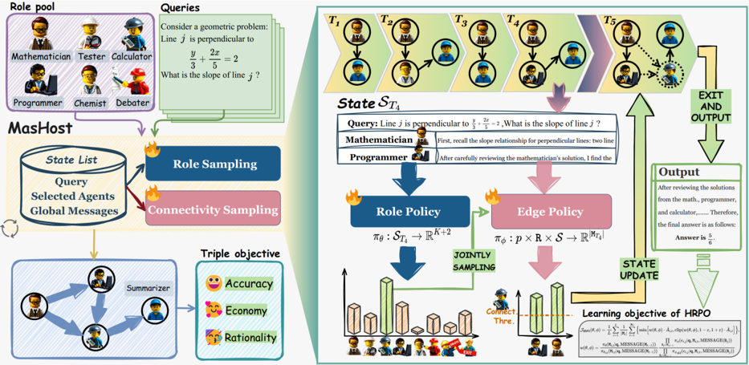 
*图2：MasHost框架。左侧展示自主构建过程，右侧详细说明RL策略。*

*表1：与现有方法的性能对比。MasHost在多个数据集上取得最佳平均性能。*

*   **理性分析:** 验证了构建的MAS在角色分配和结构上的合理性，避免了冗余和过度简化。

*图3 (左/中/右)：MasHost的鲁棒性、角色与查询类型相似性、构建的MAS的合理性。*

### 1.4 ARIA: 意图空间奖励聚合的语言智能体RL

ARIA 提出一种离线RL框架，用于训练开放式语言动作任务中的语言智能体。

*   **核心思想:** 通过对动作进行语义聚类，并在“意图空间”中聚合奖励，解决高维动作空间带来的奖励稀疏和方差大问题。
*   **流程:** 智能体交互收集轨迹 -> 语义投影 -> 意图空间奖励聚合 -> 使用聚合奖励更新策略。
*   **评估:** 在文本游戏和对抗性任务中显著提升策略性能，优于多种基线。

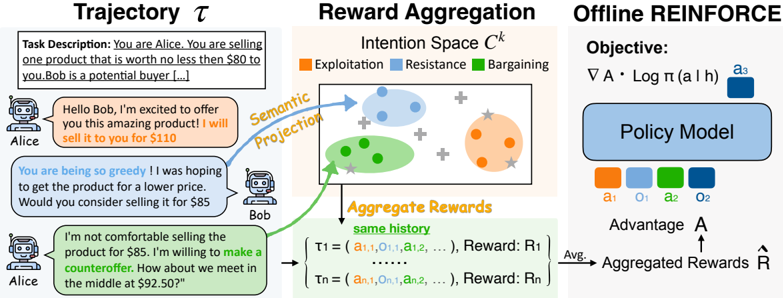 
*图1：ARIA框架图。展示了轨迹收集、语义投影、奖励聚合和策略更新流程。*

*表1：对抗性游戏的主要结果。ARIA在Bargaining和Negotiation中取得最高胜率。*

*表2：单智能体游戏的主要结果。ARIA在Twenty Questions和Guess My City中表现最佳。*

*   **效果分析:** 奖励聚合显著降低奖励方差，稳定策略学习，并通过迭代更新持续提升性能。

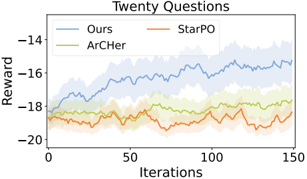 
*图3：ARIA和其他在线方法在单智能体游戏上的奖励曲线。ARIA收敛更快且性能更高。*

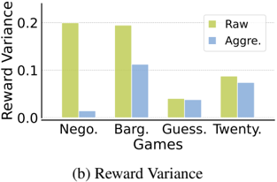 
*图4：奖励分布和奖励方差变化。奖励聚合显著降低方差。*

## 2. 特定应用场景下的RL智能体

强化学习智能体在解决特定领域的复杂决策问题中展现出潜力。

### 2.1 物流执行任务编排 (SAP LE)

利用DQN (Deep Q-Network) 进行SAP Logistics Execution (LE) 的任务编排。

*   **方法:** DQN学习优化任务序列，从仓库状态中学习。
*   **评估:** 在包含中断的SAP LE数据集上测试，DQN在准确率、精确率、召回率和F1分数上优于Random Forests和基于规则的系统，并显著减少处理时间。

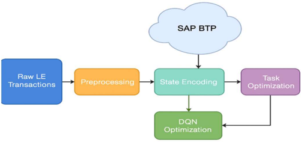 
*图1：工作流程图。展示了SAP LE任务编排的端到端RL流程。*

 
*图5：处理时间减少条形图。DQN实现了最高的处理时间减少。*

### 2.2 交通信号控制

比较固定时间控制器与基于MARL的交通信号控制器。

*   **方法:** MARL方法将每个交通灯视为自主学习智能体，使用DQN根据实时交通状况优化信号相位。
*   **评估:** 在模拟环境中，MARL控制器在通过车辆数量上略有增加，但显著减少了车辆平均等待时间 (减少78.26%)。

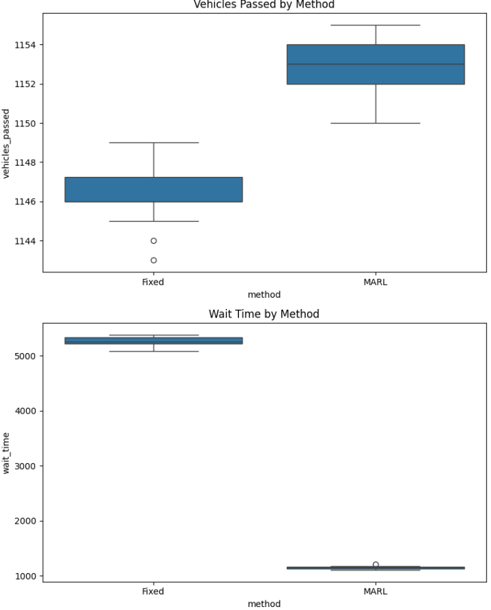 
*图4：固定时间控制器和MARL控制器在通过车辆数量和等待时间上的箱线图对比。MARL显著降低等待时间。*

*表I：固定时间控制器和MARL控制器的详细性能指标。MARL在等待时间上有巨大优势。*

### 2.3 边缘网络分布式智能 (EdgeAgentX)

EdgeAgentX 提出一个三层架构，结合联邦学习 (FL)、MARL和对抗防御，用于分布式边缘智能。

*   **架构:** 联邦学习层 (全局协调)、MARL层 (分布式边缘智能)、对抗防御层 (安全与鲁棒性)。
*   **优势:** 相较于基线，EdgeAgentX实现了更低的延迟、更高的吞吐量、更快的收敛速度和对对抗性攻击的鲁棒性。

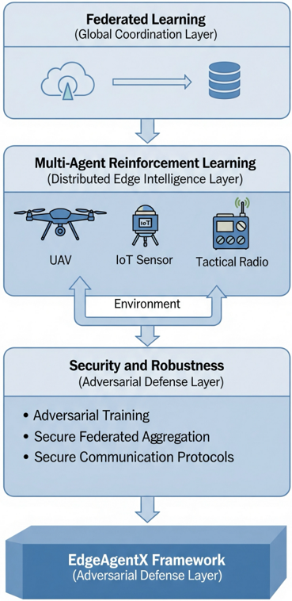 
*图1：EdgeAgentX概念架构。展示了三层设计。*

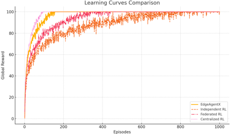 
*图2：EdgeAgentX与基线方法的学习曲线对比。EdgeAgentX收敛更快且达到更高奖励。*

### 2.4 基于LLM语义编码的RL智能体 (AEC)

AEC (Agentic Episodic Control) 框架在文本环境中利用LLM进行语义编码，增强RL智能体的状态表示和记忆能力。

*   **核心思想:** 使用LLM生成富有常识的语义状态嵌入，结合情景记忆和世界图工作记忆，实现高效决策和泛化。
*   **关键组件:** LLM-based语义编码器、情景记忆模块、世界图工作记忆模块。
*   **评估:** 在BabyAI-Text任务上表现优异，收敛更快，性能更高，并展示了跨任务记忆迁移能力。

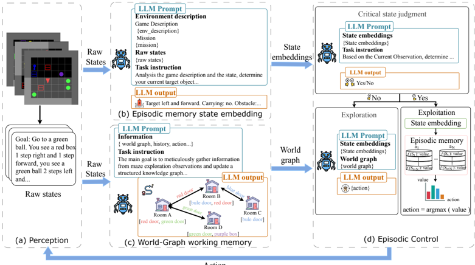 
*图1：Agentic Episodic Control框架概述。展示了状态处理、记忆模块和决策流程。*

*表1：在BabyAI-Text任务上的最终成功率。AEC在多个任务和设置下表现领先。*

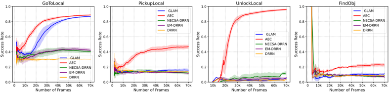 
*图3：AEC与基线方法在BabyAI-Text任务上的学习曲线。AEC收敛更快。*

*表2：跨任务记忆迁移结果。从相关任务迁移记忆能提升性能。*

## 3. 新兴方向：量子智能体

随着量子计算发展，量子智能体成为新兴研究领域，旨在结合量子信息处理能力与智能体行为。

*   **定义:** 量子智能体是感知、处理、行动跨越经典和量子维度的自主系统。
*   **组成:** 感知 (经典/量子通道)、处理 (量子算法+经典控制)、行动 (量子操作/经典信号)。
*   **成熟度模型:** 分为L1 (NISQ优化)、L2 (混合QML策略)、L3 (领域感知自适应)、L4 (完全量子原生)，与量子硬件发展阶段对应。

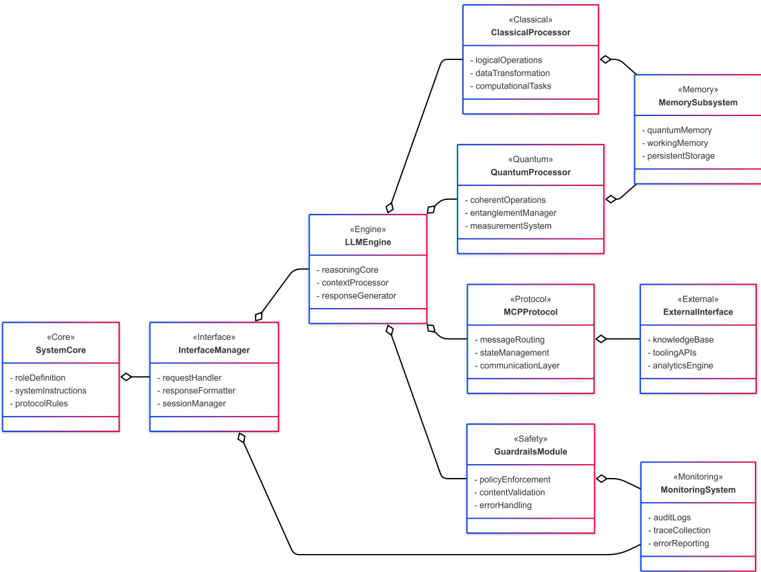 
*图1：量子智能体系统架构。结合经典和量子组件的模块化框架。*

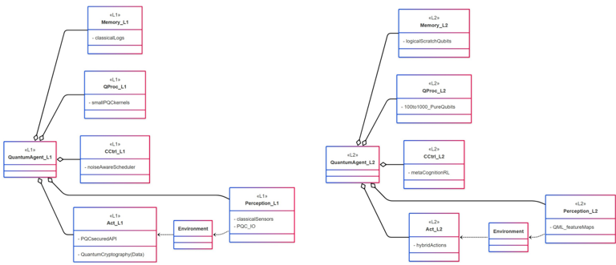 
*图2：量子智能体的成熟度模型 (L1-L4)。*

*   **应用示例:**
    *   **量子多臂老虎机:** 使用变分量子电路作为策略，学习识别最优臂。

 
*图6：智能体使用的量子策略电路。*

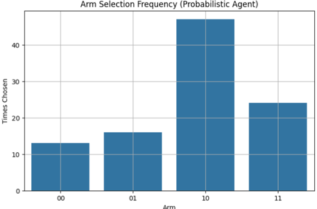 
*图9：臂选择频率直方图。智能体收敛到最优臂10。*

    *   **自适应量子图像加密:** 量子智能体学习选择加密策略 (如XOR, QFT, Scramble)，基于图像特征和加密结果反馈进行优化。

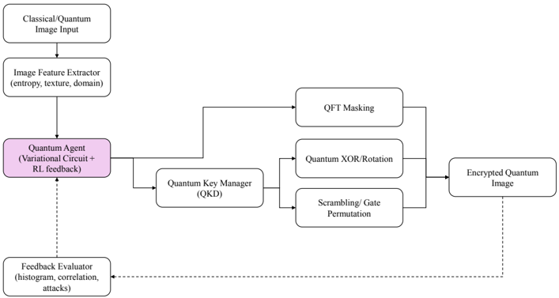 
*图10：自适应量子图像加密量子智能体架构。*

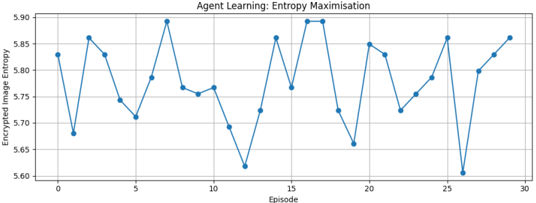 
*图15：加密图像熵随episode的变化。智能体学习偏好产生高密文熵的变换。*

## 4. 共同主题与技术

近期Agent-RL研究中涌现出一些共同的主题和技术：

*   **多智能体协作与架构:** 探索更有效的智能体间交互机制 (如MHGPO的群组采样、ANN的分层团队、MasHost的图构建)。
*   **RL用于优化与设计:** 不仅用于优化智能体策略，还用于优化智能体架构和工作流程 (如MasHost的自主构建、ANN的文本梯度优化)。
*   **奖励整形与处理:** 针对LLM和复杂环境中的稀疏、高维奖励问题，采用相对奖励 (MHGPO)、奖励聚合 (ARIA) 等技术。
*   **LLM在状态/动作空间处理中的作用:** 利用LLM进行语义编码增强状态表示 (AEC)，或处理开放式语言动作空间 (ARIA)。
*   **记忆机制:** 结合情景记忆 (AEC) 提升样本效率和泛化能力。
*   **文本反馈与梯度:** 利用LLM生成的文本反馈作为优化信号 (ANN)。

## 5. 结论

近期的Agent-RL研究在多个方面取得了显著进展。在LLM领域，研究人员正积极探索更高效、更自主、更具协作性的多智能体系统优化和设计方法，通过创新的奖励机制和架构设计克服挑战。同时，Agent-RL也在物流、交通、边缘计算等实际应用中展现出巨大潜力。此外，量子计算与智能体的结合为Agent-RL开辟了新的前沿领域，尽管尚处于早期阶段，但预示着未来的发展方向。这些进展共同推动着智能体技术向更复杂、更自主、更强大的方向发展。
