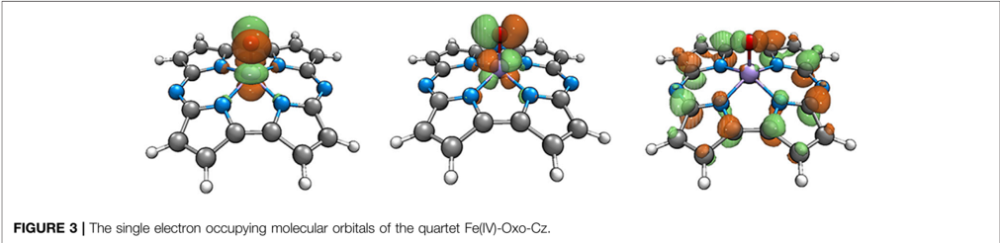
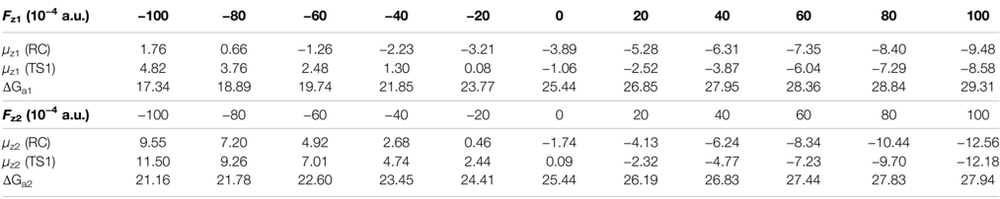
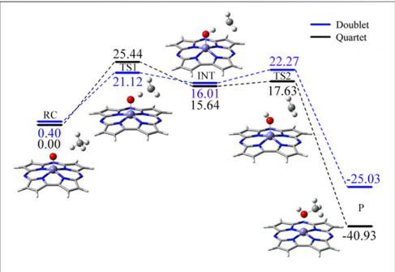
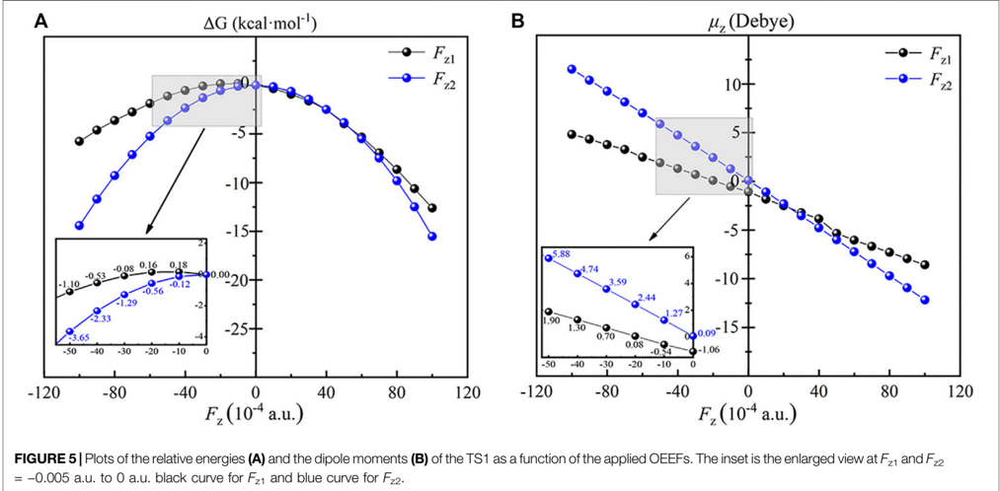
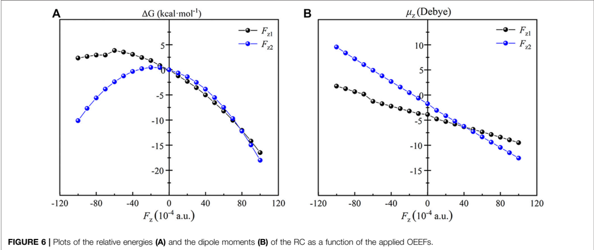
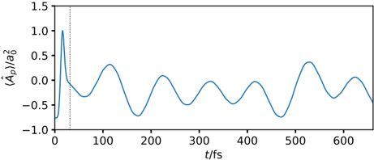

Query:
    在计算化学这个领域，我们通常使用Gaussian软件模拟各种情况下分子的结构和性质计算，比如在关键词中加入'field=x+100'代表了在x方向增加了电场。但是，当体系是经典的单原子催化剂时，它属于分子催化剂，在反应环境中分子的朝向是不确定的，那么理论模拟的x方向电场和实际电场是不一致的。请问：通常情况下，理论计算是如何模拟外加电场存在的情况？

---

## 理论计算中外加电场效应的模拟策略报告

### 摘要

在计算化学领域，使用高斯（Gaussian）等软件通过`Field`关键词施加外加电场（External Electric Field, EEF）是研究电场对分子结构、性质和反应性影响的常用方法。然而，正如您所指出的，对于溶液或气相中的单原子/分子催化剂，其朝向是随机的，这导致了理论模型中固定方向的电场与实际情况之间存在差异。本报告将结合前沿研究案例，系统阐述理论计算领域应对此问题的主流策略。

核心结论是，理论计算通常不采用对所有可能朝向进行统计平均的复杂方法，而是采用一种更具化学洞察力的**定向外电场（Oriented External Electric Field, OEEF）模型**。该模型假设在反应发生的微环境中，电场相对于分子的关键化学键或活性位点具有一个特定的、有意义的朝向。

---

### 1. 主流策略：定向外电场（OEEF）模型

OEEF模型是目前研究电场催化效应最核心、最有效的方法。它并非简单地沿笛卡尔坐标轴（x, y, z）施加电场，而是沿着与反应密切相关的**分子内部坐标**（如关键化学键轴、分子偶极矩方向等）施加电场。

**核心思想：**
1.  **化学相关性**：选择的电场方向具有明确的化学意义，例如沿着即将断裂或形成的化学键方向，这能最有效地探测电场对特定反应步骤的影响。
2.  **模拟局部环境**：在真实催化环境（如酶活性中心、电极表面、扫描隧道显微镜针尖下方）中，溶剂分子、带电基团或外部电极会产生一个相对于催化剂活性位点方向性很强的**局部电场**。OEEF模型正是对这种局部、定向电场的有效模拟。
3.  **探索催化潜力**：通过OEEF模型，研究者可以系统地探索电场在“最理想”方向上对反应的调控潜力和作用机理，为实验设计提供理论指导。

#### 1.1 案例研究：OEEF调控Fe(IV)-氧代咯嗪催化甲烷氧化

一项研究利用OEEF模型，系统探讨了电场如何调控Fe(IV)-氧代咯嗪（Fe(IV)-Oxo-Cz）催化甲烷（CH₄）转化为甲醇（CH₃OH）的反应。

**1.1.1 无电场下的反应路径**

在没有外加电场时，反应主要分为两步：首先是Fe=O的氧原子夺取CH₄的一个氢原子（H-abstraction），越过能垒为25.44 kcal/mol的过渡态TS1；然后是新生成的Fe-OH上的羟基快速回弹（rebound）到·CH₃上，生成产物甲醇。

 
**图1**: 无电场下Fe(IV)-Oxo-Cz催化CH₄氧化的反应路径。RC(反应物)，TS1(第一过渡态)，INT(中间体)，P(产物)。

 
**表1**: 无电场下反应路径上各物种的关键键长与相对能量。

**1.1.2 OEEF的施加与作用机理**

研究人员沿着两个关键化学方向施加了OEEF：
*   **Fz1**: 沿 Fe-O 轴方向。
*   **Fz2**: 沿 O-H 过渡态轴方向。

**图2**: OEEF施加方向示意图。

电场通过与体系偶极矩（μ）的相互作用（相互作用能 ≈ -μ·F）来影响体系的能量。当电场方向与偶极矩方向一致时，体系被稳定；反之则被去稳定。

**1.1.3 OEEF对反应物（RC）和过渡态（TS1）的能量影响**

如下图所示，施加不同方向和强度的电场后，反应物（RC）和过渡态（TS1）的相对能量发生了显著变化。这种变化的本质是电场改变了分子的电子云分布，诱导了偶极矩的变化，从而导致了不同的静电相互作用能。

 
**图3**: (A) OEEF对过渡态TS1相对能量的影响。(B) OEEF对过渡态TS1偶极矩的影响。

 
**图4**: OEEF对反应物RC相对能量和偶极矩的影响。

**1.1.4 OEEF对反应能垒的调控**

反应能垒是过渡态与反应物的能量差。由于电场对TS1和RC的稳定化/去稳定化程度不同，最终导致反应能垒发生改变。

*   当施加**正向电场（Fz > 0）**时，RC比TS1得到更强的稳定化，导致反应能垒升高，抑制反应。
*   当施加**负向电场（Fz < 0）**时，TS1比RC得到更强的稳定化，导致反应能垒**显著降低**，从而催化反应。例如，在Fz1 = -0.010 a.u.的电场下，能垒从25.44 kcal/mol降低至**17.34 kcal/mol**。

 
**图5**: OEEF对反应能垒（ΔG‡）的影响。可见负向电场（Fz1和Fz2 < 0）能有效降低能垒。

**表2**: 不同电场强度下RC和TS1的偶极矩及反应能垒。

**1.1.5 OEEF改变反应机理，提升选择性**

更有趣的是，强负向电场不仅降低了能垒，还改变了反应机理。在Fz1 = -0.010 a.u.的电场下，O-H键在过渡态中被拉长，电荷分布也发生变化，使得氢转移过程变得更困难。其结果是，体系在夺氢后不再形成稳定的中间体（INT），而是直接进行“回弹”生成产物甲醇。这避免了中间体可能发生的副反应，从而**极大地提升了反应的选择性**。

**表3**: 不同负向电场下过渡态TS1的O-H键长和原子NPA电荷。

---

### 2. 补充策略：动态模拟分子在场中的取向

除了静态的OEEF模型，另一种更复杂的策略是直接模拟分子在时变电场（如激光脉冲）中的动力学行为。这种方法不预设分子的朝向，而是研究电场如何**诱导分子发生取向**。

#### 2.1 案例研究：激光场驱动下的HD分子取向

一项研究通过求解含时薛定谔方程，模拟了HD分子在激光脉冲（一种振荡的电场）作用下的动态行为。

 
**图6**: HD分子在100个周期的激光脉冲作用下取向参数`<Âp>`随时间的变化。`<Âp>`的值反映了分子轴与电场方向的对齐程度。

 
**图7**: 不同时刻HD分子的电子密度分布图，直观展示了分子从随机取向到与电场方向对齐的过程。

这种动态模拟方法能够直接回答“分子如何在电场中运动和取向”的问题，但其计算成本极高，通常用于研究超快动力学、分子操控等领域，对于研究稳态催化反应机理则较少使用。

---

### 3. 结论与解答

回到您最初的问题：**对于取向不确定的分子催化剂，理论计算如何模拟外加电场？**

1.  **标准做法是OEEF模型**：计算化学的主流做法是采用**定向外电场（OEEF）模型**。您在Gaussian中使用的`field=x+100`就是一个简化的OEEF模型。这里的关键在于，**"x"方向的选择不是任意的，而是一个经过深思熟虑的、具有化学意义的方向**。研究者会首先优化分子结构，然后根据反应的性质，将电场方向定义在如Fe=O键轴、分子对称轴等关键位置上，从而研究定向电场对催化活性的调控。

2.  **OEEF的合理性**：这种看似简化的模型是合理的，因为它有效地模拟了真实催化微环境中（如酶、电极表面）**局部电场的方向性**。它旨在回答一个核心科学问题：“如果存在一个特定方向的电场，它将如何影响反应？”

3.  **动态模拟作为补充**：对于分子本身与电场的相互作用（如分子如何被电场对齐），可以使用更复杂的动态模拟方法。但这通常用于不同的研究目的，而非直接用于研究催化反应能垒。

因此，您不必过于担心理论模拟中固定方向的电场与宏观溶液中分子随机取向的矛盾。理论计算通过OEEF模型，巧妙地将问题从“模拟无限个随机朝向的平均效果”转化为“**探索特定化学方向上的电场调控潜力**”，这是一种更高效且富有洞察力的研究策略。
