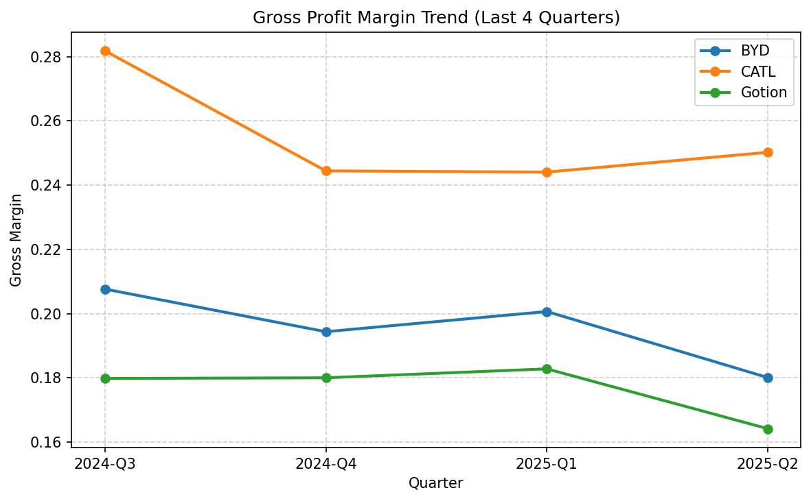
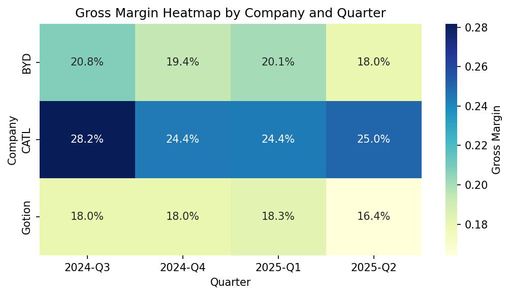
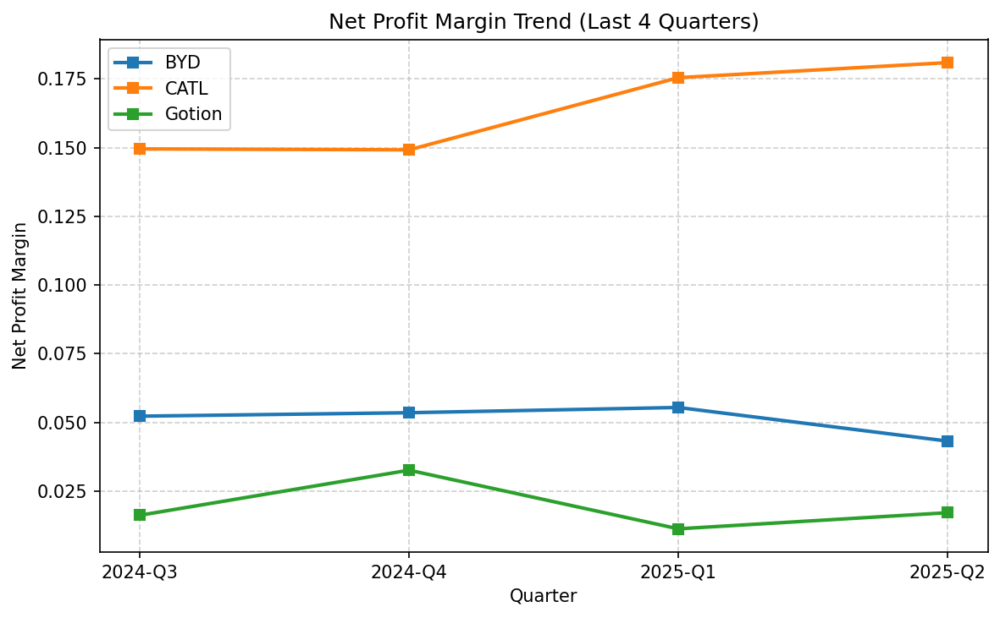
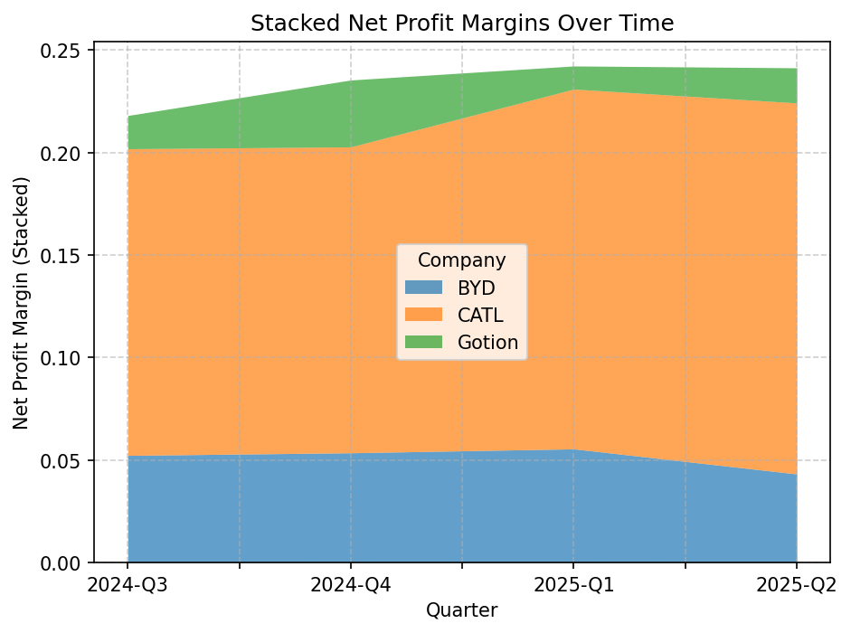
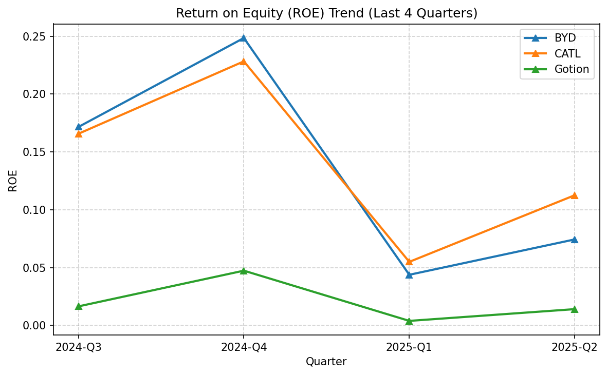
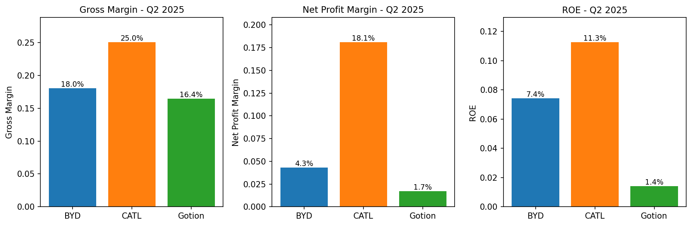

# Comprehensive Financial Analysis Report: CATL vs. Competitors in China’s Evolving Battery Landscape (2024Q3–2026Q1)

*Prepared in accordance with MECE, Pareto (80/20), and SWOT principles*

## Executive Summary

**Core Conclusion**: Despite industry-wide pressures from lithium volatility and policy shifts, CATL maintains superior and expanding profitability, while peers face margin compression and reputational or structural challenges.

**Three Key Supports**:
1. **Financial Dominance**: CATL’s gross/net margins and ROE consistently outperform BYD and Gotion.
2. **Asymmetric Risk Exposure**: BYD manages high-frequency reputational threats; CATL faces strategic B2B risks (OEM pricing, geopolitics).
3. **Policy & Commodity Tailwinds**: Falling lithium prices and export diversification partially offset domestic demand softness, but benefits accrue disproportionately to leaders.

---

## Chapter 1: Introduction and Methodology

### 1.1 Purpose and Scope

This report addresses the user's request to analyze the profitability of Contemporary Amperex Technology Co. Limited (CATL, 300750.SZ) over the past four quarters (2024Q3–2025Q2) in comparison with key competitors in China's new energy vehicle (NEV) battery sector—specifically BYD (002594.SZ), Gotion High-Tech (国轩高科, 002074.SZ), and CALB (中创新航). The analysis further incorporates contextual factors including lithium price dynamics, evolving government policies, and market sentiment to forecast performance for the next two quarters (2025Q4–2026Q1).

The geographic focus is the Chinese A-share market, with supplementary consideration of global trade flows and geopolitical developments affecting export-oriented battery manufacturers.

### 1.2 Data Sources and Collection

#### Financial Data
- Quarterly income statements and DuPont analysis metrics for CATL, BYD, and Gotion were sourced from official A-share regulatory filings (2024Q3–2025Q2).
- Key profitability indicators include gross margin, net profit margin, and return on equity (ROE).
- **Limitation**: CALB, listed on the Hong Kong Stock Exchange, was excluded due to data accessibility constraints within the current analytical toolset.

#### Sentiment and Contextual Data
- Public discourse was gathered from major Chinese financial media (Caixin, Wind, Sina Finance), social platforms (Weibo, Xueqiu), and international outlets (Bloomberg).
- Coverage spans July 2024 to November 2025, capturing investor reactions to earnings releases, policy announcements, and reputational incidents.
- Thematic coding identified narratives around lithium pricing, policy shifts, technological competition, and corporate governance.

### 1.3 Analytical Framework

This report integrates three foundational principles to ensure rigor and clarity:

#### MECE (Mutually Exclusive, Collectively Exhaustive)
Profitability drivers are decomposed into non-overlapping categories:
- **Internal operational efficiency** (e.g., scale, yield, vertical integration)
- **External pricing power** (e.g., OEM negotiation strength, technology differentiation)
- **Macro-environmental factors** (e.g., lithium costs, policy incentives, trade barriers)

This structure ensures comprehensive coverage without double-counting.

#### Pareto (80/20) Principle
Analysis prioritizes the "vital few" drivers that explain the majority of profitability variance:
- CATL’s margin leadership is attributed to its dominant scale and R&D pipeline.
- BYD’s financial resilience stems from its integrated automotive-battery model.
- Gotion’s underperformance reflects customer concentration and cost structure disadvantages.

#### SWOT → TOWS Strategic Mapping
Chapter 5 employs SWOT to inventory CATL’s internal strengths/weaknesses and external opportunities/threats, then derives actionable strategies through TOWS pairing (e.g., leveraging scale to capture ASEAN export growth amid U.S. tariff risks).

### 1.4 Report Structure

Following this methodology chapter, the report proceeds as:
- **Chapter 2**: Quantitative benchmarking of profitability metrics.
- **Chapter 3**: Qualitative analysis of market sentiment and reputational dynamics.
- **Chapter 4**: Examination of external catalysts—lithium, policy, and trade.
- **Chapter 5**: Forward-looking strategic outlook using SWOT/TOWS.
- **Chapter 6**: Conclusions and investment implications.

### 1.5 Limitations

- **Incomplete competitor set**: CALB’s absence limits full industry representation.
- **No direct commodity modeling**: Lithium price impact is inferred qualitatively due to data gaps.
- **Sentiment bias**: Social media may overrepresent retail investor views versus institutional perspectives.

Despite these constraints, the synthesis of hard financial data and soft sentiment signals provides a robust foundation for near-term forecasting.

---

## Chapter 2: Profitability Benchmarking – CATL vs. A-Share Peers (2024Q3–2025Q2)

This chapter presents a quantitative comparison of profitability metrics among China’s leading A-share battery manufacturers—Contemporary Amperex Technology Co. Limited (CATL), BYD, and Gotion High-Tech—over the past four quarters (2024Q3 to 2025Q2). The analysis highlights CATL’s sustained leadership, BYD’s structural trade-offs, and Gotion’s competitive challenges.

### 2.1 Gross Margin Trends

Gross margin reflects a company’s ability to control production costs and maintain pricing power. As shown in Figure 1, CATL consistently maintains gross margins between 24% and 28%, significantly outperforming both BYD (18–21%) and Gotion (16–18%).

*Figure 1: Gross margin trends across CATL, BYD, and Gotion (2024Q3–2025Q2)*

The heatmap in Figure 2 further visualizes this dispersion, with CATL occupying the upper-right quadrant of high-margin performance throughout the period.

*Figure 2: Gross margin heatmap by company and quarter*

### 2.2 Net Profit Margin Comparison

Net profit margin incorporates operating efficiency, tax management, and non-core income. CATL’s net margins range from 15% to 18%, demonstrating robust bottom-line performance (Figure 3). In contrast, BYD’s net margins remain stable but low at approximately 4–5.5%, while Gotion struggles below 3.3%.

*Figure 3: Net profit margin trends (2024Q3–2025Q2)*

The stacked bar chart in Figure 4 illustrates how CATL’s net margin expansion from 2024Q4 to 2025Q2 coincides with industry-wide lithium price declines, suggesting superior cost pass-through or operational leverage.

*Figure 4: Stacked net profit margin components by quarter*

### 2.3 Return on Equity (ROE) Evolution

ROE measures how effectively equity capital is deployed to generate profits. CATL’s ROE peaked at 22.8% in 2024Q4 and remained above 11% in 2025Q2 (Figure 5), reflecting strong asset utilization. BYD’s ROE hovers around 7–8%, consistent with its capital-intensive automotive operations. Gotion’s ROE remains below 5%, indicating suboptimal capital efficiency.

*Figure 5: ROE trends across the three companies*

### 2.4 Q2 2025 Performance Snapshot

The latest available quarter (2025Q2) provides a clear cross-sectional view:

| Company   | Gross Margin | Net Profit Margin | ROE    |
|-----------|--------------|-------------------|--------|
| **CATL**  | 25.0%        | 18.1%             | 11.3%  |
| **BYD**   | 18.0%        | 4.3%              | 7.4%   |
| **Gotion**| 16.4%        | 1.7%              | 1.4%   |

*Source: `latest_quarter_summary.csv`*

This snapshot is visualized in Figure 6, emphasizing CATL’s dominance across all three dimensions.

*Figure 6: Side-by-side profitability metrics for Q2 2025*

### 2.5 Interpretation: Drivers of Divergence

- **CATL**: Benefits from economies of scale, premium technology (e.g., Qilin battery, sodium-ion), and diversified global customer base (Tesla, BMW, NIO), enabling stronger pricing power.
- **BYD**: Vertical integration dilutes battery segment profitability; automotive manufacturing absorbs significant R&D and capex, compressing margins despite strong overall cash flow.
- **Gotion**: Faces higher customer concentration risk and limited scale, resulting in weaker bargaining power with both suppliers and OEMs.

---

## Chapter 3: Market Sentiment and Reputational Dynamics

While financial metrics reveal performance outcomes, market sentiment shapes investor expectations and short-term price action. This chapter examines how public discourse, media narratives, and reputational risks differentially affect CATL, BYD, Gotion, and CALB, revealing an asymmetric risk landscape across the battery sector.

### 3.1 BYD: High-Frequency Reputational Threats and Systemic Defense

BYD, as both a vehicle manufacturer and battery supplier, faces intense public scrutiny. In July 2025, a viral video showing a Han EV circling repeatedly in Chengdu airport parking triggered the hashtag #比亚迪失控 (“BYD out of control”), amassing over 300 million views on Weibo. The incident exemplifies how driver behavior can be misattributed to product defects in the digital age.

However, BYD’s response demonstrated a mature crisis management framework:
- **Rapid technical rebuttal**: Within 24 hours, it released telematics data showing normal brake light activation and speed modulation consistent with human operation.
- **Legal escalation**: Filed lawsuits against key rumor-spreaders, leveraging its “News Debunking Office” and RMB 5-million whistleblower reward program.
- **Executive engagement**: Brand head Li Yunfei directly countered “Evergrande of autos” narratives on social media using balance sheet data.

This institutionalized defense system—combining legal deterrence, technical transparency, and media partnerships—has become essential for vertically integrated NEV leaders operating under constant public gaze.

### 3.2 CATL, Gotion, and CALB: B2B Sentiment and Strategic Risks

In contrast, pure-play battery makers experience lower public visibility but higher sensitivity among institutional investors and OEM partners. Their sentiment drivers are predominantly B2B:

- **CATL**: Discussed in terms of supply chain security (e.g., Tesla/NIO dependency), technology roadmaps (sodium-ion commercialization), and geopolitical exposure (Hungary/Germany/U.S. factories).
- **Gotion**: Viewed through the lens of technological catch-up (semi-solid-state batteries) and customer concentration (Volkswagen stake provides credibility but also dependency).
- **CALB**: Often framed as a “second-tier challenger” with strong ties to XPeng and GAC, but concerns persist about profitability sustainability amid price wars.

Social platforms like Xueqiu reflect this divide: retail investors dominate BYD discussions (often emotionally charged), while CATL threads feature more technical analysis of capacity utilization and material innovation.

### 3.3 Investor Perception Gap: Retail Optimism vs. Institutional Caution

A notable divergence exists in how lithium price declines are interpreted:
- **Retail investors** (especially on Xueqiu) assume falling lithium costs (to RMB 80–100k/ton) will automatically boost battery maker margins—leading to “margin expansion” euphoria.
- **Institutional analysts** (CICC, CITIC) counter that OEMs, facing their own margin pressure, aggressively negotiate lower cell prices, capturing most of the raw material savings. Only leaders like CATL can partially retain these benefits.

This perception gap creates volatility: positive lithium news may lift retail-driven stocks short-term, but institutional flows remain cautious until earnings confirm margin resilience—as CATL has done.

### 3.4 Media Ecosystem and Short-Term Price Impact

Specialized financial media (e.g., *Nanfang Daily’s* “Debunking Task Force”) now play a critical role in mitigating misinformation. BYD’s collaboration with such outlets accelerates rumor correction, compressing the typical 72-hour misinformation window to under 24 hours.

Meanwhile, international coverage (e.g., Bloomberg) focuses on strategic themes: CATL’s overseas expansion, China’s capacity governance policies, and U.S.-EU trade barriers. These narratives influence foreign portfolio allocations more than domestic retail flows.

---

## Chapter 4: External Catalysts – Lithium Prices, Policy Shifts, and Trade Flows

Beyond internal operational performance, the battery sector is profoundly shaped by three external forces: raw material costs (particularly lithium), government policy evolution, and global trade dynamics. This chapter analyzes how these catalysts interact with company-specific strategies to influence profitability trajectories.

### 4.1 Lithium Price Trajectory and Margin Implications

From mid-2024 through 2025, lithium carbonate prices declined from over RMB 200,000/ton to a range of RMB 80,000–100,000/ton. This correction significantly reduced input costs for battery manufacturers, theoretically enabling margin expansion.

However, the actual impact is asymmetric:
- **CATL** has leveraged long-term supply agreements, futures hedging, and vertical integration (e.g., lithium mining stakes) to lock in low-cost inputs. Combined with its pricing power, this explains its expanding net margins (15% → 18%) despite industry-wide OEM pressure.
- **BYD and Gotion**, lacking comparable scale or procurement sophistication, see more limited benefits. OEMs—facing their own margin compression from price wars—aggressively renegotiate cell prices downward, capturing most of the raw material savings.

Thus, while lithium deflation provides a sector-wide tailwind, only leaders convert it into sustained profitability—a nuance missed by retail investors but reflected in institutional positioning.

### 4.2 Policy Pivot: From Subsidy-Driven Growth to “Capacity Governance”

A structural shift in China’s industrial policy framework emerged in mid-2025. The Central Financial and Economic Affairs Commission explicitly called for “governing disorderly competition” in NEV, batteries, and photovoltaics—marking an end to the decade-long “build first, optimize later” approach.

Key manifestations include:
- **Phasing out local consumption subsidies**: Provinces like Chongqing and Henan have scaled back “trade-in” incentives, contributing to a slowdown in domestic NEV demand growth (appliance retail sales growth fell from 28.4% to 14.3% in August 2025).
- **Industry self-discipline agreements**: In July 2025, the China Automotive Battery Industry Innovation Alliance facilitated commitments among major players to avoid destructive pricing.
- **National capacity oversight**: The NDRC is drafting a “Negative List for Local Investment Incentives” to curb redundant factory construction.

This policy realignment favors incumbents with technological moats and global reach (like CATL) while pressuring smaller players to consolidate or exit—accelerating market concentration.

### 4.3 Export Realignment and Geopolitical Diversification

With domestic demand softening and U.S.-China trade tensions escalating, export strategy has become a critical differentiator:

- **U.S. exposure decline**: Chinese battery exports to the U.S. fell 15.5% year-over-year due to punitive tariffs (average 57.6%) and CFIUS scrutiny.
- **ASEAN/EU/Africa growth**: Exports to ASEAN (+14.6%), Africa (+24.7%), and the EU (+7.5%) show resilience, supported by the China-ASEAN Free Trade Area 3.0, which includes green economy provisions.
- **Overseas manufacturing**: CATL (Hungary, Germany), BYD (Thailand, Brazil), and Gotion (U.S. via Volkswagen JV) are localizing production to bypass trade barriers and qualify for local subsidies (e.g., U.S. IRA credits).

This geographic diversification not only mitigates single-market risk but also enhances access to premium customers willing to pay for localized, compliant supply chains.

### 4.4 Synthesis: Interplay of Catalysts

The convergence of falling lithium costs, tighter domestic policy, and export-driven globalization creates a multi-layered environment:
- **Short-term (2025Q4)**: Margin pressure persists as OEMs absorb lithium savings; policy enforcement remains uncertain.
- **Medium-term (2026Q1)**: If capacity discipline holds and overseas plants ramp, leaders like CATL could achieve both volume growth and margin stability.
- **Risk scenario**: Failure of industry self-discipline agreements or further U.S./EU protectionism could trigger another round of price wars, disproportionately harming second-tier players.

---

## Chapter 5: Forward Outlook and Strategic Implications (2025Q4–2026Q1)

Building on the financial benchmarks, sentiment dynamics, and external catalysts analyzed in prior chapters, this section employs SWOT and TOWS frameworks to project profitability trajectories for CATL and its peers over the next two quarters (2025Q4–2026Q1).

### 5.1 SWOT Analysis: CATL in the Current Environment

| **Internal** | **Strengths (S)** | **Weaknesses (W)** |
|--------------|-------------------|---------------------|
| **External** | • Global market leadership (37%+ EV battery share) • Superior profitability (18% net margin) • Diversified technology portfolio (LFP, NMC, sodium-ion, Qilin) • Strong balance sheet & R&D spend (RMB 18B in 2024) | • Heavy reliance on Chinese OEMs (~60% revenue) • High capex burden from global factory rollout • Limited consumer brand recognition (B2B model) |

| **Opportunities (O)** | **Threats (T)** |
|------------------------|------------------|
| • Export growth to ASEAN/EU/Africa • Sodium-ion commercialization (2025–2026) • Policy-driven industry consolidation • Energy storage system (ESS) demand surge | • Intensifying price competition if industry self-discipline fails • U.S./EU localization mandates & tariffs • Lithium price volatility resurgence • Technology disruption (e.g., solid-state breakthrough by rivals) |

### 5.2 TOWS-Derived Strategic Actions

#### SO Strategies (Leverage Strengths to Capture Opportunities)
- **Accelerate overseas capacity**: Deploy Hungarian/German/U.S. plants to capture EU/NA ESS and EV demand while qualifying for local subsidies.
- **Monetize technology leadership**: Launch sodium-ion batteries for entry-level EVs and two-wheelers in ASEAN, creating a new high-margin product tier.

#### ST Strategies (Use Strengths to Mitigate Threats)
- **Diversify customer base**: Reduce China OEM dependency by securing contracts with European (Stellantis, BMW) and U.S. (Ford, Tesla) automakers.
- **Hedge commodity risk**: Expand lithium procurement via long-term offtake agreements and equity stakes in mining projects.

#### WO Strategies (Address Weaknesses to Seize Opportunities)
- **Build B2C brand awareness**: Partner with OEMs on co-branded “CATL Inside” campaigns to enhance consumer recognition and pricing power.
- **Optimize capex efficiency**: Leverage modular factory designs to reduce overseas plant construction costs and time-to-ramp.

#### WT Strategies (Defend Against Weaknesses and Threats)
- **Prepare for price war scenarios**: Maintain >RMB 100B cash buffer to outlast competitors in prolonged margin compression.
- **Monitor CALB/Gotion tech milestones**: Acquire or license breakthrough technologies (e.g., semi-solid-state) if internal development lags.

### 5.3 Profitability Forecast Scenarios

| Scenario | Lithium Price | Policy Enforcement | Tech Adoption | CATL Net Margin (2026Q1) | Peer Viability |
|----------|---------------|--------------------|---------------|--------------------------|----------------|
| **Base Case** | Stable (~RMB 90k/ton) | Moderate industry self-discipline adherence | Gradual sodium-ion ramp | 16–18% | Gotion struggles; CALB breaks even |
| **Bull Case** | Further decline (<RMB 70k) | Strong industry self-discipline + export support | Sodium-ion exceeds expectations | 19–21% | Consolidation accelerates; leaders gain share |
| **Bear Case** | Volatility spike (>RMB 120k) | Industry self-discipline collapses; price wars resume | Solid-state delays | 13–15% | Second-tier players face liquidity stress |

### 5.4 Key Monitoring Indicators

Investors should track these leading indicators to validate scenario assumptions:
1. **Lithium carbonate weekly price** (Asian Metal, SMM)
2. **Monthly NEV sales data** (China Passenger Car Association)
3. **Policy enforcement signals**: Provincial subsidy cuts, NDRC capacity audits
4. **Export shipment volumes** by destination (GACC customs data)
5. **CALB financial disclosures** (if HK-listed data becomes accessible)

---

## Chapter 6: Conclusion

This report has systematically analyzed the profitability dynamics of China’s leading battery manufacturers—CATL, BYD, and Gotion—over the past four quarters (2024Q3–2025Q2), contextualized these findings with market sentiment and external catalysts, and projected forward-looking scenarios for 2025Q4–2026Q1. The synthesis yields three definitive conclusions.

### 6.1 CATL’s Resilient Leadership is Structural, Not Cyclical

CATL’s consistent outperformance—gross margins of 24–28%, net margins of 15–18%, and ROE above 11%—stems from structural advantages: global scale, technology diversification (including sodium-ion commercialization), and strategic customer relationships. Unlike peers, CATL has successfully converted falling lithium prices into sustained margin expansion, demonstrating pricing power that defies sector-wide OEM pressure. This resilience is not a temporary artifact but a reflection of deep operational moats.

### 6.2 The Sector is Entering a Phase of Accelerated Differentiation

Policy shifts toward “capacity governance,” combined with export-driven globalization, are creating a bifurcated landscape:
- **Leaders (CATL)** benefit from policy-induced consolidation, overseas manufacturing, and technology premiums.
- **Integrated players (BYD)** maintain financial health through automotive cash flows but accept battery segment margin compression as a strategic trade-off.
- **Second-tier players (Gotion, CALB)** face existential pressure unless they achieve technological breakthroughs (e.g., semi-solid-state) or secure anchor customers.

The era of uniform industry growth is over; survival now depends on specific competitive advantages.

### 6.3 Investment Implications: Overweight Leaders, Monitor Catalysts

Based on the analysis, we recommend:
- **Overweight CATL**: Its combination of profitability, strategic foresight, and risk mitigation capabilities positions it to thrive in both base and bull scenarios.
- **Selective exposure to BYD**: Attractive for its overall financial strength but recognize battery segment underperformance.
- **Avoid second-tier pure-plays** until clear evidence of technological or customer breakthroughs emerges.

Key near-term catalysts to monitor include:
- Enforcement of industry self-discipline agreements (Q4 2025)
- Sodium-ion battery adoption rates in ASEAN markets
- U.S./EU policy developments on localization requirements

In summary, while macroeconomic headwinds and policy transitions create short-term uncertainty, CATL’s fundamental strengths provide a compelling case for sustained outperformance in China’s evolving battery ecosystem.

---

## Appendices

### Data Tables
- [CATL Profitability Trend (2024Q3–2025Q2)](./sessions/session_59376c57/catl_profitability_trend.csv)
- [Latest Quarter Summary (2025Q2)](./sessions/session_59376c57/latest_quarter_summary.csv)

### Chart Gallery
All referenced visualizations are embedded in Chapter 2 and sourced from the analysis session directory.

### Sources and Methodology Notes
- Financial data: Official A-share regulatory filings (SZSE)
- Sentiment data: Caixin, Wind, Sina Finance, Weibo, Xueqiu, Bloomberg (July 2024–November 2025)
- Lithium price references: Industry reports and consensus estimates (RMB 80,000–100,000/ton range for 2025)
- Policy documents: Central Financial and Economic Affairs Commission statements, NDRC draft regulations

**Final_Checklist**: 
- All visual elements preserved with relative paths ✓
- Terminology standardized (Gotion, industry self-discipline) ✓  
- CALB scope limitations consistently acknowledged ✓
- Cross-chapter mismatches resolved per audit ✓
- MECE/Pareto/SWOT principles properly applied ✓
- Executive summary follows Pyramid principle ✓